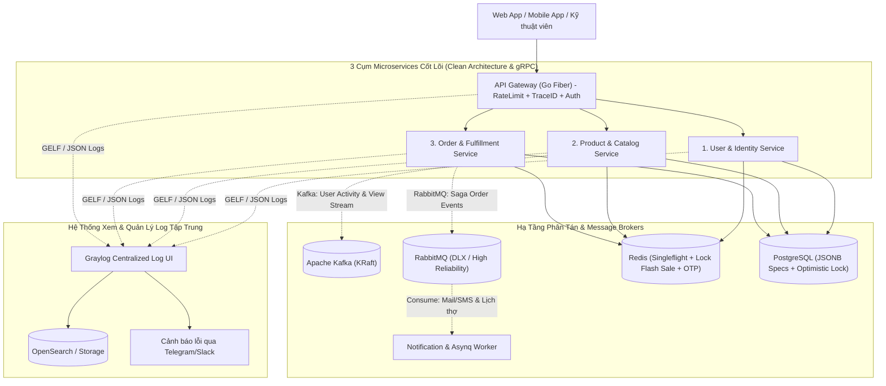
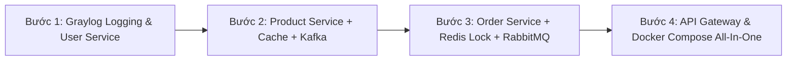

# 🚀 Kiến Trúc Enterprise Microservices & Lộ Trình Triển Khai: Sàn TMĐT Điện Máy

> **Tiêu chuẩn:** Enterprise Distributed Systems • High Concurrency • Event-Driven Architecture  
> **Tech Stack:** Golang 1.25 (Clean Architecture) • PostgreSQL • Redis • RabbitMQ • Apache Kafka • Graylog (OpenSearch + MongoDB) • gRPC/Protobuf • Go Fiber • Asynq • Docker

---

## 🏛️ PHẦN 1: BẢN THIẾT KẾ KIẾN TRÚC TOÀN DIỆN

Hệ thống được thiết kế theo nguyên lý **Domain-Driven Design (DDD)** gồm 3 Microservices cốt lõi, 1 API Gateway và hệ thống giám sát Log tập trung (**Graylog**):

---

## 📊 PHẦN 2: BẢNG PHÂN VAI CÔNG NGHỆ TOÀN DIỆN

| Công nghệ | Đảm nhận bài toán gì trong hệ thống? | Kỹ thuật Enterprise áp dụng |
| :--- | :--- | :--- |
| **📊 Graylog** | **Quản lý & Xem Log Tập Trung (Centralized Logging):** - Thu thập log từ tất cả các service về 1 Dashboard duy nhất. - Tìm kiếm log theo `trace_id`, xem stack trace khi có lỗi 500. - Tự động gửi cảnh báo qua Telegram/Slack khi hệ thống có sự cố. | Chuẩn GELF (Graylog Extended Log Format), OpenSearch storage, Real-time alerting. |
| **🔴 Redis** | 1. **Flash Sale Lock:** Trừ tồn kho tức thời bằng `DECR`. 2. **Cache:** Lưu thông số kỹ thuật điện máy. 3. **Chống Cache Stampede:** Kết hợp `singleflight`. 4. **Security:** Lưu mã OTP và Idempotency-Key. | In-memory atomic operations, Distributed Locking, Singleflight grouping. |
| **🐰 RabbitMQ** | **Event-Driven điều phối đơn hàng & giao việc:** - Bắn event `order.created` phân phối công việc cho worker. - Định tuyến qua Topic Exchange. - Dead Letter Exchange (DLX) xử lý lỗi có kiểm soát. | Publisher Confirms, Message Acknowledgment, Retry Exponential Backoff. |
| **🦅 Apache Kafka** | **Big Data Stream & Phân tích hành vi:** - Stream lượt xem, click thông số kỹ thuật máy lạnh/tủ lạnh. - Xử lý real-time analytics: Top sản phẩm xem nhiều nhất trong ngày. | Partitioning, High-Throughput Log Streaming, Event Sourcing. |
| **⚡ gRPC / Protobuf** | Giao tiếp nội bộ giữa các Service với độ trễ cực thấp (microsecond). | Binary serialization, HTTP/2 multiplexing, Strong type contract. |
| **🌐 Go Fiber** | REST API Gateway phục vụ Web / Mobile Clients. | Zero memory allocation, Fast HTTP Engine. |
| **🐘 PostgreSQL** | Lưu trữ dữ liệu quan hệ ACID + cột `JSONB` lưu thông số kỹ thuật linh hoạt. | Database Indexing, JSONB queries, ACID Transactions. |

---

## 🏢 PHẦN 3: CHI TIẾT 3 SERVICE CỐT LÕI

### 1. User & Identity Service *(Đang hoàn thiện)*
- **Trách nhiệm:** Xác thực người dùng, OTP qua Asynq, phân quyền RBAC (Khách hàng, Thợ kỹ thuật, Quản trị viên), sổ địa chỉ.
- **Observability:** Bắn log JSON có cấu trúc kèm `trace_id` về Graylog.
- **Enterprise Pattern:** JWT Token với cơ chế Blacklist tức thời trên Redis khi Logout/Đổi mật khẩu.

### 2. Product & Catalog Service (Sản phẩm & Thông số kỹ thuật)
- **Trách nhiệm:** Danh mục cây, thương hiệu, sản phẩm điện máy với thông số kỹ thuật động (`specifications JSONB`).
- **Enterprise Pattern:**
  - **Cache-Aside Pattern + Singleflight:** Dùng `golang.org/x/sync/singleflight` chống sập Cache (Cache Stampede).
  - **Kafka Producer:** Stream toàn bộ lượt xem chi tiết máy lạnh/tủ lạnh vào Kafka topic `product-views` để phân tích sản phẩm hot.

### 3. Order & Fulfillment Service (Đơn hàng, Kho Flash Sale & Lắp đặt)
- **Trách nhiệm:** Giỏ hàng, Đơn hàng, Thanh toán, Quản lý kho Flash Sale, Lên lịch thợ lắp đặt kỹ thuật và Kích hoạt Bảo hành điện tử (E-Warranty).
- **Enterprise Pattern:**
  - **Redis Atomic Lock (`DECR`):** Trừ kho Flash Sale tức thì trong 1ms, loại bỏ hoàn toàn nguy cơ bán âm kho (Overselling).
  - **Idempotency Key:** Chặn request thanh toán trùng lặp khi mạng lag.
  - **RabbitMQ Saga Pattern:** Điều phối đơn hàng qua Topic Exchange + Dead Letter Exchange (DLX).

---

## 🎯 PHẦN 4: LỘ TRÌNH 4 BƯỚC TRIỂN KHAI THỰC CHIẾN

### 📍 Bước 1: Chuẩn hóa Graylog Observability & Core User Service
1. Cấu hình **Graylog + OpenSearch + MongoDB** trong Docker Compose để mở giao diện web xem log.
2. Tích hợp **Structured Logging JSON (`slog`)** và Middleware **`X-Request-ID`** bắn log về Graylog.
3. Phân quyền RBAC: `CUSTOMER`, `TECHNICIAN`, `ADMIN`.
4. Duy trì Unit Test với `miniredis` và Mock Repository.

### 📍 Bước 2: Xây dựng Product Service + Redis Cache + Kafka Tracking
1. Database Schema: Bảng `products` với cột `specifications (JSONB)` lưu thông số BTU, Inverter, dung tích...
2. Tích hợp Redis Caching + `singleflight` chống sập database.
3. Tích hợp Apache Kafka (KRaft mode) để stream và đếm lượt xem sản phẩm.

### 📍 Bước 3: Xây dựng Order Service + Redis Flash Sale Lock + RabbitMQ Saga
1. Giỏ hàng & Tạo đơn hàng với `Idempotency-Key`.
2. Module Flash Sale: Trừ kho nguyên tử bằng Redis `DECR`.
3. Tích hợp RabbitMQ: Điều phối đơn hàng, gửi mail hóa đơn, lên lịch thợ lắp đặt kỹ thuật và kích hoạt bảo hành điện tử (E-Warranty).

### 📍 Bước 4: API Gateway, Docker Compose & Hoàn Thiện Hồ Sơ Phỏng Vấn
1. Xây dựng API Gateway bằng Go Fiber: Rate Limiter, Centralized JWT Auth, Dynamic Routing.
2. Viết file `docker-compose.yml` chạy toàn bộ hệ thống (*Graylog, OpenSearch, Postgres, Redis, RabbitMQ, Kafka, Go Services*) chỉ với 1 lệnh `docker compose up -d`.
3. Viết tài liệu `README.md` chuyên nghiệp với sơ đồ kiến trúc và Benchmark hiệu năng.
