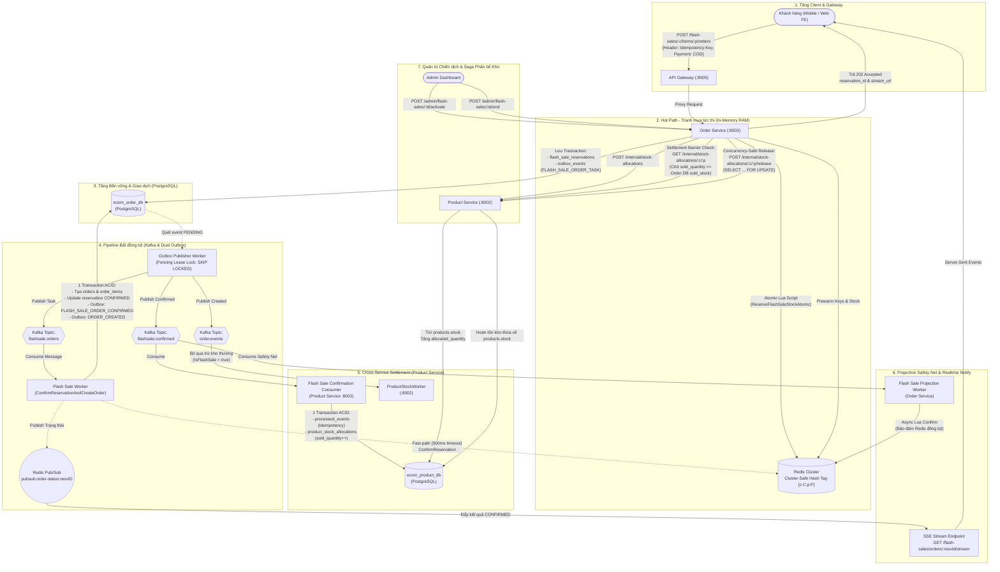

# ⚡ KIẾN TRÚC HỆ THỐNG FLASH SALE CHUẨN PRODUCTION
### High-Concurrency Distributed Flash Sale Engine (Golang, Redis Cluster, Kafka, PostgreSQL)

---

## 1. Trạng Thái Triển Khai Hệ Thống (Frontend & Backend)

### 1.1. Đã có trong Frontend (FE) chưa?
> **Tình trạng:** **ĐÃ HOÀN TẤT & TÍCH HỢP 100%**

* **Trang chủ (`frontend/src/features/flash-sale/components/flash-sale-section.tsx`)**:
  - Tự động gọi API `GET /flash-sales/active` để lấy chiến dịch đang diễn ra từ Backend.
  - Hiển thị đồng hồ đếm ngược (Countdown Timer) chính xác theo thời gian `ends_at` của chiến dịch thực tế.
  - Hiển thị thanh tiến độ kho và phần trăm đã bán (`sold_stock / allocated_stock`), kèm huy hiệu hạn mức (Deal sốc 1 suất / Mua tối đa N món).
* **Modal Đặt mua (`frontend/src/features/flash-sale/components/flash-sale-modal.tsx`)**:
  - Tự động sinh mã UUID v4 làm `Idempotency-Key` trong Header để chống duplicate khi click đúp.
  - Cho phép tùy chọn số lượng mua (nếu chiến dịch cho phép mua nhiều lần; khóa ở 1 nếu là Deal sốc).
  - Gửi request đến `POST /flash-sales/:campaignId/items/:productId/orders` (trả về 202 Accepted).
  - Kết nối trực tiếp đường truyền **Server-Sent Events (SSE)** `/flash-sales/orders/:reservationId/stream` nhận kết quả `CONFIRMED` realtime từ Redis Pub/Sub, kèm cơ chế polling fallback tự động.

---

### 1.2. Khi tạo 1 chiến dịch mới đã có chưa?
> **Tình trạng:** **ĐÃ CÓ ĐẦY ĐỦ Ở CẢ BACKEND VÀ GIAO DIỆN FRONTEND ADMIN**

* **Giao diện Quản trị Admin (`frontend/src/app/admin/flash-sales/page.tsx`)**:
  - Bảng điều khiển thống kê (Đang chạy, Bản nháp, Đã kết thúc) kèm bộ lọc trạng thái.
  - **Modal tạo chiến dịch mới trực quan**:
    - Nhập tên chiến dịch, thời gian bắt đầu (`starts_at`) và kết thúc (`ends_at`).
    - Chọn mã sản phẩm, giá sale, giá gốc, số lượng phân bổ (`allocated_stock`).
    - **Lựa chọn loại hạn mức**:
      - **Loại 1 (Deal sốc)**: Mỗi khách mua đúng 1 lần/1 món (`max_quantity_per_user: 1`).
      - **Loại 2 (Xả kho)**: Khách được mua nhiều lần qua nhiều đơn hàng đến hạn mức tích lũy N (`max_quantity_per_user: N`).
  - **Nút hành động ngay trên giao diện**:
    - **Kích hoạt Saga (Activate)**: Gọi `POST /admin/flash-sales/:id/activate` $\rightarrow$ Trừ kho thường `Product Service` và Prewarm RAM Redis.
    - **Nhân bản (Clone Campaign)**: Gọi `POST /admin/flash-sales/:id/clone` $\rightarrow$ Sao chép cấu hình sang đợt mới để khách mua lại mà không làm mất lịch sử cũ.
    - **Kết thúc (End Campaign)**: Gọi `POST /admin/flash-sales/:id/end` $\rightarrow$ Thu hồi tồn kho thừa về Product Service.

---

## 2. Sơ đồ Kiến trúc Tổng thể (High-Level Architecture)

Hệ thống được thiết kế theo mô hình **Hot-Path in-memory (RAM) & Async Background Processing** kết hợp **Dual Outbox Event Streaming & Cross-Service Settlement Barrier**:
* **99% lượng tải** tranh mua (Peak Concurrency) được giải quyết và chặn đứng tức thì trong vài milli-giây tại tầng **Redis Cluster Lua Script**.
* Cơ sở dữ liệu quan hệ **PostgreSQL chỉ nhận đúng số lượng request đã giành được suất giữ chỗ**.
* **Dual Outbox Publishing**: Đảm bảo đồng bộ `sold_quantity` sang Product Service và cập nhật Redis Projection an toàn kể cả khi worker crash.
* **Settlement Barrier & Fencing**: Ngăn chặn tuyệt đối hoàn kho sớm khi consumer Kafka còn đang xử lý dở dang.



---

## 3. Chi tiết Các Thành phần Kỹ thuật Đã Xây dựng

### 3.1. Engine Redis Chống Bán Âm & Tương thích Redis Cluster (`pkg/redislock`)
1. **Hash Tag `{c:C:p:P}`**:
   - Tất cả các khóa liên quan đến một sản phẩm trong chiến dịch (stock, quota người dùng, hash reservations, expiry zset) đều chứa chung tiền tố `{c:C:p:P}` (ví dụ: `fs:{c:1:p:100}:stock`).
   - **Tác dụng**: Buộc Redis Cluster băm cùng một Hash Slot, cho phép thực thi Multi-Key Lua Script nguyên tử mà **không bị lỗi `CROSSSLOT Keys in request don't hash to the same slot`**.
2. **Loại bỏ Lệch đồng hồ phân tán (Clock Skew)**:
   - Lua script gọi trực tiếp `redis.call('TIME')` lấy thời gian của node Redis làm thước đo chuẩn, không phụ thuộc vào giờ hệ thống của các server web app lệch nhau.
3. **Cơ chế Hạn mức Linh hoạt (Hỗ trợ cả 2 loại nghiệp vụ)**:
   - **Loại 1 (`max_quantity_per_user = 1`)**: Kiểm tra `(reserved_qty + purchased_qty) + buy_qty <= 1`. Nếu đã giữ chỗ hoặc đã mua $\rightarrow$ Từ chối ngay với mã `ERR_MAX_LIMIT_EXCEEDED`.
   - **Loại 2 (`max_quantity_per_user = N`)**: Cho phép cùng 1 tài khoản mua nhiều lần qua nhiều đơn hàng nhỏ, miễn tổng số lượng tích lũy không vượt quá $N$. (Nếu đặt `0` là không giới hạn số lượng).
4. **Idempotency Fingerprint cấp độ IETF / Stripe**:
   - Khóa `fs:{c:C:p:P}:req:U:R` lưu kết quả kèm SHA-256 fingerprint nội dung đơn.
   - Gửi lại cùng ID và cùng nội dung $\rightarrow$ Trả kết quả cũ (an toàn khi rớt mạng).
   - Gửi lại cùng ID nhưng đổi nội dung $\rightarrow$ Báo lỗi `409 IDEMPOTENCY_KEY_REUSED`.

---

### 3.2. Saga Phân bổ Tồn kho 2 Pha, Chính sách COD & Database-per-Service
Tuân thủ nguyên tắc cách ly dữ liệu: `order-service` sở hữu `ecom_order_db`, `product-service` sở hữu `ecom_product_db`. Không dùng chung kết nối DB, không dùng 2PC nặng nề.

> **“2 pha” ở đây không phải Two-Phase Commit (2PC) của database.** Không có một transaction duy nhất khóa đồng thời cả hai DB. Đây là Saga do `Order Service` điều phối, gồm: (1) **chuẩn bị/cấp phát** kho cho toàn bộ sản phẩm và prewarm Redis ở trạng thái chưa bán; (2) **commit nghiệp vụ/công bố** campaign bằng cách chuyển DB rồi Redis sang `ACTIVE`. Khi một bước cấp phát Product Service thất bại, Saga chạy các API bồi hoàn idempotent để trả những phần kho đã cấp phát.

#### 1. Chính sách Thanh toán COD-Only (Loại trừ Rủi ro Xuất kho Sớm)
* **Quy định nghiêm ngặt**: Tất cả các yêu cầu giữ chỗ đơn hàng Flash Sale (`POST /flash-sales/:campaignId/items/:productId/orders`) bắt buộc phải sử dụng phương thức thanh toán **COD (Cash On Delivery)**.
* **Lý do thiết kế**:
  - Trong sự kiện Flash Sale tốc độ cao, số lượng đã bán (`sold_quantity`) được ghi nhận ngay khi đơn hàng được xác nhận thành công.
  - Nếu cho phép Online Payment (VNPAY, MoMo, Thẻ tín dụng...), khách hàng có thể hoàn tất giữ chỗ nhưng sau đó không thanh toán hoặc thanh toán thất bại. Việc này dẫn đến:
    - Hoặc tăng sớm `sold_quantity` ở Product Service khi tiền chưa về (sai lệch sổ cái doanh số/tồn kho).
    - Hoặc phải thiết kế luồng bồi hoàn cực kỳ phức tạp để giảm `sold_quantity` và hoàn kho Flash Sale sau khi cổng thanh toán báo timeout.
  - Áp dụng chính sách COD giúp quy trình chốt đơn diễn ra tức thì, dứt khoát: Đơn được xác nhận $\rightarrow$ Order được tạo $\rightarrow$ `sold_quantity` tăng ngay lập tức và chuẩn xác 100%.

#### 2. Vì sao cần Database-per-Service?

`Order Service` chỉ quản lý campaign, item, reservation và order; nó không được tự chạy câu SQL trừ `products.stock`. Ngược lại, chỉ `Product Service` được sửa kho sản phẩm và sổ cái phân bổ. Vì vậy mỗi bước chỉ có thể ACID **bên trong DB của service sở hữu dữ liệu**:

| Service | Dữ liệu sở hữu | Thay đổi nguyên tử cục bộ |
|---|---|---|
| Product Service | `products`, `product_stock_allocations`, `processed_events` | Trừ kho thường và tạo allocation; cập nhật `sold_quantity` kèm idempotency trong cùng transaction |
| Order Service | `flash_sale_campaigns`, `flash_sale_items`, reservations, outbox, orders | Đổi trạng thái campaign; lưu reservation + outbox; tạo đơn + xác nhận reservation + outbox trong transaction của Order DB |

Tính nhất quán xuyên hai service đạt được bằng `request_id` để retry an toàn, state machine của campaign, **Settlement Barrier** khi kết thúc, và **compensating transaction** (giao dịch bồi hoàn), thay vì rollback SQL xuyên hai DB.

* **Sổ cái phân bổ (`product_stock_allocations`)**:
  - Nằm trong `ecom_product_db`.
  - Quản lý 3 trạng thái: `allocated_quantity` (đã cấp phát cho Flash Sale), `sold_quantity` (đã xuất đơn), `released_quantity` (hoàn trả về kho thường).
* **Quy trình Kích hoạt Resumable (Activation Saga)**:
  1. Admin gọi kích hoạt $\rightarrow$ `Order Service` chuyển trạng thái chiến dịch sang `ALLOCATING`.
  2. `Order Service` gọi API nội bộ `POST /internal/stock-allocations` sang `Product Service` để khóa kho thường chuyển sang kho Flash Sale (sử dụng `request_id = alloc-camp-{id}-prod-{pid}`).
  3. Nếu thành công: Nạp tồn kho và cấu hình lên RAM Redis $\rightarrow$ Lưu DB `ACTIVE` $\rightarrow$ Mở Redis `ACTIVE`.
  4. **Compensating Rollback (Bồi hoàn tự động)**: Nếu bất kỳ sản phẩm nào không đủ kho hoặc mạng lỗi, `Order Service` tự động gọi `POST /internal/stock-allocations/:campaignId/:productId/release` hoàn trả kho của những sản phẩm đã phân bổ trước đó, đưa trạng thái về `ACTIVATION_FAILED`.
  5. **Tính năng Resumable**: Nếu hệ thống khởi động lại giữa chừng khi campaign đang ở `ALLOCATING`, Admin có thể gọi lại `activate` an toàn nhờ cơ chế Idempotency trên Product Service.

#### 3. Settlement Barrier & Concurrency-Safe Release khi Kết thúc Chiến dịch (`EndCampaign`)

Khi một chiến dịch Flash Sale kết thúc (do hết giờ hoặc Admin chủ động đóng sớm qua `POST /admin/flash-sales/:campaignId/end`):
1. **Chuyển trạng thái sang `ENDING` & Khóa Redis**: Ngừng nhận đơn mới trên Redis ngay lập tức.
2. **Settlement Barrier (Hàng rào chốt sổ)**:
   - Trong kiến trúc Event-Driven, các đơn hàng vừa chốt có thể vẫn đang nằm trên topic Kafka `flashsale.confirmed` và Product Service đang tiêu thụ.
   - Nếu `Order Service` gọi hoàn kho ngay lập tức, `product_stock_allocations.sold_quantity` ở Product DB có thể nhỏ hơn thực tế trong Order DB (`sold_stock`), dẫn đến việc tính toán hoàn trả nhầm cả những sản phẩm khách hàng đã mua!
   - **Giải pháp Settlement Barrier**:
     - `Order Service` gọi API `GET /internal/stock-allocations/:campaignId/:productId` sang `Product Service`.
     - Kiểm tra điều kiện chốt: `ProductDB.sold_quantity >= OrderDB.sold_stock`.
     - Nếu chưa thỏa mãn, hệ thống tạm dừng và retry (tối đa 10 lần với exponential backoff).
3. **Release Tồn kho Concurrency-Safe (`ReleaseStock`)**:
   - Khi barrier đã thông suốt, `Order Service` gọi `POST /internal/stock-allocations/:campaignId/:productId/release`.
   - `Product Service` thực thi với khóa hàng `SELECT ... FOR UPDATE` trên bảng `product_stock_allocations`:
     $$\text{to\_release} = \text{allocated\_quantity} - \text{sold\_quantity} - \text{released\_quantity}$$
   - Cộng lại $\text{to\_release}$ vào `products.stock` và cập nhật `released_quantity`. Nếu $\text{to\_release} \le 0$ thì bỏ qua an toàn (Idempotent).
4. **Cập nhật trạng thái `ENDED`**: Lưu trạng thái kết thúc vào Order DB và dọn dẹp Redis cache.

* **Chống Trừ kho 2 lần**:
  - Khi đơn hàng Flash Sale được tạo xong, event `order.created` bắn ra Kafka mang cờ `IsFlashSale: true`.
  - `ProductStockWorker` (Product Service) kiểm tra cờ này và tự động bỏ qua trừ kho thường, triệt tiêu hoàn toàn rủi ro trừ kho 2 lần.

---

### 3.3. Transactional Outbox Pattern với Lease Lock Fencing

Giải quyết bài toán: *“Làm sao đảm bảo đơn hàng đã lưu vào DB thì chắc chắn Kafka sẽ nhận được sự kiện, ngay cả khi server bị crash đột ngột hoặc mạng lag làm worker bị treo?”*

1. **Giao dịch Kép Nguyên tử**: Lưu bản ghi nghiệp vụ và `outbox_events` trong cùng một Database Transaction tại PostgreSQL.
2. **Lease Lock không giữ DB Connection**:
   - `OutboxPublisherWorker` dùng `SELECT ... FOR UPDATE SKIP LOCKED` để lấy lô 50 event `PENDING`.
   - Cập nhật `locked_by = worker_id`, `locked_until = NOW() + 30s`, `status = PROCESSING` và **COMMIT NGAY LẬP TỨC**.
   - Bắn Kafka ở ngoài transaction. Nhờ vậy connection pool của DB không bị nghẽn trong lúc chờ mạng Kafka.
3. **Lease Ownership Verification (Fencing Token Pattern)**:
   - Khi publish Kafka thành công, worker gọi `MarkPublished(eventID, workerID)`.
   - Câu lệnh SQL kiểm tra quyền sở hữu nghiêm ngặt:
     ```sql
     UPDATE outbox_events
     SET status = 'PUBLISHED', published_at = NOW(), locked_by = NULL, locked_until = NULL
     WHERE id = :id AND status = 'PROCESSING' AND locked_by = :worker_id;
     ```
   - Kiểm tra `RowsAffected == 1`. Nếu `RowsAffected == 0` (do worker bị GC pause quá 30 giây khiến lease hết hạn và worker khác đã claim lại), worker cũ sẽ phát hiện mất quyền và hủy bỏ, tránh hoàn toàn lỗi ghi đè trạng thái sai lệch.
   - Khi gặp lỗi mạng Kafka: Worker gọi `MarkFailed(eventID, workerID, errMsg)` với cùng cơ chế lease check, tăng `attempts` và tính Exponential Backoff cho `next_attempt_at`.

---

### 3.4. Dual Outbox Publishing & Cross-Service Settlement (`flashsale.confirmed`)

Nhằm đảm bảo tính nhất quán tuyệt đối giữa Order DB, Product DB và Redis:

#### 1. Luồng xử lý nguyên tử trong FlashSaleWorker
Khi worker tiêu thụ một message đặt hàng từ topic `flashsale.orders`:
1. Mở một Database Transaction duy nhất trong `ecom_order_db`:
   - Kiểm tra trạng thái reservation (phải là `RESERVED`).
   - Cập nhật reservation sang `CONFIRMED`.
   - Tạo bản ghi trong `orders` và `order_items`.
   - Ghi đồng thời **2 Outbox Events**:
     - `FLASH_SALE_ORDER_CONFIRMED` $\rightarrow$ Topic `flashsale.confirmed` (chứa `order_token`, `reservation_id`, `campaign_id`, `product_id`, `quantity`).
     - `ORDER_CREATED` $\rightarrow$ Topic `order.events` (chứa `is_flash_sale = true`).
   - Commit transaction.
2. **Hybrid Fast-Path tới Redis & Pub/Sub**:
   - Sau khi DB commit thành công, worker gọi hàm `ConfirmFlashSaleReservation` lên Redis với **strict timeout 500ms**.
   - Bắn Pub/Sub channel `pubsub:order-status:<reservationID>` để SSE stream trả kết quả `CONFIRMED` ngay lập tức về cho client mà không phải chờ Kafka round-trip.
   - Nếu Redis bị timeout hoặc mạng chập chờn: Worker **không rollback DB** (vì DB đã commit là chân lý), mà để Kafka consumer bên dưới xử lý bù.
3. **Xử lý lỗi DB Transaction an toàn**:
   - Nếu xảy ra lỗi DB tạm thời (deadlock, connection drop), worker trả về `error` để Kafka consumer nack/requeue và thử lại sau.
   - **Tuyệt đối không gọi hủy đơn (`CancelReservationAtomic`)** khi gặp lỗi DB tạm thời, bảo vệ quyền lợi giữ chỗ của khách hàng.

#### 2. FlashSaleConfirmationConsumer (Product Service)
* Lắng nghe topic `flashsale.confirmed` với consumer group `product-flashsale-confirm-group`.
* Sử dụng bảng `processed_events` làm chốt chặn Idempotency:
  ```go
  // Thực thi trong 1 DB Transaction của Product Service:
  // 1. Chặn trùng lặp sự kiện
  err := processedEventRepo.InsertIfNew(tx, "product_flashsale_confirm_consumer", eventID)
  if errors.Is(err, domain.ErrDuplicateEvent) {
      return nil // Đã xử lý rồi, an toàn commit offset
  }
  // 2. Tăng sold_quantity trên sổ cái phân bổ kho
  err = stockAllocRepo.IncrementSoldQuantityTx(tx, campaignID, productID, quantity)
  ```
* Cơ chế này đảm bảo dù Kafka có gửi lại message nhiều lần (At-least-once), số lượng đã bán `sold_quantity` chỉ tăng chính xác một lần duy nhất.

#### 3. FlashSaleProjectionWorker (Order Service - Safety Net)
* Lắng nghe topic `flashsale.confirmed` với consumer group `order-flashsale-projection-group`.
* Đóng vai trò tấm lưới an toàn bất đồng bộ (Asynchronous Safety Net):
  - Kiểm tra trạng thái reservation trên Redis.
  - Nếu fast-path trước đó bị timeout hoặc fail mạng, projection worker sẽ thực thi Lua script `ConfirmFlashSaleReservation` để chuyển trạng thái Redis sang `CONFIRMED`, dịch chuyển hạn mức và dọn dẹp ZSet.

---

### 3.5. Bộ đôi Workers Quét Hết hạn & Ghost Cleanup

* **`ReservationExpiryWorker`**:
  - Quét các đơn giữ chỗ quá thời hạn thanh toán (ví dụ: quá 120 giây chưa hoàn tất đặt hàng).
  - Tự động gọi Lua script `ReleaseReservationAtomic` trên Redis để nhả kho và quota, đồng thời cập nhật DB về `EXPIRED`.
* **`ReconciliationWorker` (Dọn dẹp giữ chỗ ma & Chống rò rỉ ZSet)**:
  - Nếu xảy ra sự cố hiếm gặp: Redis vừa giữ chỗ xong thì server sập điện trước khi kịp mở DB Transaction $\rightarrow$ Worker quét Redis Expiry ZSet, phát hiện reservation ID quá hạn mà **không hề tồn tại trong PostgreSQL** $\rightarrow$ Tự động thu hồi và hoàn lại tồn kho trên Redis.
  - **Khắc phục ZSet Leak cho Đơn CONFIRMED**: Khi quét thấy reservation trong DB đã ở trạng thái `CONFIRMED` nhưng vẫn còn sót lại trong Redis Expiry ZSet (do fast-path rớt mạng), worker tự động gọi `ConfirmFlashSaleReservation` để dọn dẹp triệt để reservation khỏi ZSet, ngăn chặn memory leak trên Redis Cluster.
* **`OrderEmailWorker` Resilience**:
  - Khi gửi email xác nhận đơn hàng qua SMTP gặp sự cố mạng, worker không nuốt lỗi mà trả về error để Kafka retry với exponential backoff, đảm bảo khách hàng luôn nhận được email thông báo đơn hàng.

---

### 3.6. Thông báo Realtime SSE Stream & Polling Fallback

* Endpoint `/flash-sales/orders/:reservationId/stream`:
  - Trả về ngay Snapshot trạng thái hiện tại (giải quyết triệt để race condition: đơn được tạo quá nhanh trước khi client kịp mở kết nối SSE).
  - Lắng nghe Redis Pub/Sub kênh `pubsub:order-status:<reservationID>`.
  - Giữ kết nối với heartbeat ping định kỳ 15 giây.
  - Tự động ngắt kết nối khi đơn đạt trạng thái cuối (`CONFIRMED`, `CANCELLED`, `EXPIRED`).
* Endpoint `/flash-sales/orders/:reservationId`: Cho phép Web Client polling định kỳ để dự phòng nếu trình duyệt không hỗ trợ SSE hoặc mạng rớt.

---

## 4. Danh mục API Đã Xây dựng (API Catalog)

### 4.1. Admin APIs (Quản trị Chiến dịch)
| Method | Endpoint | Quyền hạn | Mô tả chức năng |
| :--- | :--- | :--- | :--- |
| `POST` | `/admin/flash-sales` | Admin | Tạo đợt Flash Sale (`name`, `starts_at`, `ends_at`) |
| `GET` | `/admin/flash-sales` | Admin | Danh sách đợt sale (phân trang, lọc theo trạng thái) |
| `GET` | `/admin/flash-sales/:campaignId` | Admin | Chi tiết đợt sale & danh sách sản phẩm |
| `POST` | `/admin/flash-sales/:campaignId/items` | Admin | Thêm sản phẩm, giá sale, kho phân bổ, quota `max_per_user` |
| `POST` | `/admin/flash-sales/:campaignId/activate` | Admin | Kích hoạt Saga phân bổ kho & Prewarm Redis (Resumable) |
| `POST` | `/admin/flash-sales/:campaignId/clone` | Admin | **Nhân bản đợt sale** sang campaign mới sạch sẽ |
| `POST` | `/admin/flash-sales/:campaignId/end` | Admin | Kết thúc sale có Settlement Barrier & hoàn kho an toàn |

### 4.2. Internal APIs (Giao tiếp Nội bộ Microservices)
| Method | Endpoint | Gọi từ | Mô tả chức năng |
| :--- | :--- | :--- | :--- |
| `POST` | `/internal/stock-allocations` | Order Service | Khóa tồn kho thường, ghi nhận sổ cái phân bổ |
| `GET` | `/internal/stock-allocations/:c/:p` | Order Service | Truy vấn sổ cái phân bổ (dùng cho Settlement Barrier) |
| `POST` | `/internal/stock-allocations/:c/:p/release` | Order Service | Hoàn trả tồn kho Flash Sale về lại kho thường (FOR UPDATE) |

### 4.3. Customer APIs (Khách hàng Đặt mua)
| Method | Endpoint | Quyền hạn | Mô tả chức năng |
| :--- | :--- | :--- | :--- |
| `POST` | `/flash-sales/:campaignId/items/:productId/orders` | Customer | Đặt mua Flash Sale (kèm `Idempotency-Key` header, COD-only) |
| `GET` | `/flash-sales/orders/:reservationId` | Customer | Kiểm tra trạng thái đơn hàng (đọc từ RAM Redis) |
| `GET` | `/flash-sales/orders/:reservationId/stream` | Customer | Mở kết nối SSE nhận kết quả realtime |

---

## 5. Kết quả Kiểm thử Tự động (Test Results)

Hệ thống đã được kiểm thử toàn diện từ Unit Test, Concurrency Test đến Domain & Repository Integration Test:

1. **Redis Engine Test (`pkg/redislock`)**:
   - `TestFlashSaleEngine_BasicReserveConfirmRelease`: PASS
   - `TestFlashSaleEngine_MultiplePurchasesQuota`: PASS (Xác thực người dùng mua nhiều lần đạt hạn mức thì chặn)
   - `TestFlashSaleEngine_Concurrency_ZeroOversell`: PASS (**50 goroutines tranh mua đồng thời 10 suất $\rightarrow$ Đúng 10 người được mua, 40 người bị từ chối, Tồn kho âm = 0**)
2. **Product Stock Allocation & Idempotency Test (`product-service`)**:
   - `TestStockAllocation_AllocateAndRelease`: PASS
   - `TestStockAllocation_InsufficientStock`: PASS
   - `TestProcessedEventRepository`: PASS (Kiểm tra chống trùng lặp `clause.OnConflict{DoNothing: true}` và bắt `ErrDuplicateEvent`)
   - `TestConfirmationConsumer`: PASS (Kiểm tra tăng `sold_quantity` chính xác khi nhận `flashsale.confirmed`)
3. **Flash Sale Service, Repository & Saga Test (`order-service`)**:
   - `TestConfirmReservationAndCreateOrder`: PASS (Xác thực 1 Transaction tạo Order, OrderItems, đổi status CONFIRMED và sinh 2 outbox events)
   - `TestOutboxRepository_LeaseOwnership`: PASS (Xác thực Fencing Token: chỉ worker đang giữ lease mới được cập nhật outbox)
   - `TestFlashSaleService_CreateAndActivateCampaign`: PASS
   - `TestFlashSaleService_ActivateCompensatingSaga`: PASS (Mô phỏng lỗi và xác thực rollback bồi hoàn thành công)
4. **Kịch bản E2E Shell Script (`test_flash_sale.sh`)**:
   - Sinh 15 JWT Tokens độc lập cho 15 tài khoản thật.
   - Tạo chiến dịch và nạp 5 suất hàng.
   - Bắn 15 request đồng thời qua API Gateway.
   - Xác thực đúng 5 đơn 202 Accepted, 10 đơn 409 Sold Out, 0 đơn bị bán âm.

---

## 6. Vận hành Thực tế & Sẵn sàng Sản xuất (Production Operational Readiness)

Hệ thống hiện tại đã giải quyết triệt để tất cả các lỗ hổng về tính nhất quán dữ liệu phân tán (Data Inconsistency), tranh chấp ghi (Race Conditions), và rò rỉ bộ nhớ:

1. **Khả năng Chịu lỗi Mạng & Crash**:
   - Transactional Outbox với Lease Ownership ngăn chặn mất mát hoặc lặp lại event khi worker bị kill.
   - `processed_events` ở tất cả các consumer đảm bảo tính chất Effectively-Once.
2. **Bảo toàn Tồn kho Thực tế**:
   - Sự kết hợp giữa Saga bồi hoàn khi kích hoạt, chính sách thanh toán COD-only, và Settlement Barrier trước khi Release Stock giúp tồn kho giữa `Product DB`, `Order DB` và `Redis Cluster` luôn khớp nhau 100%.
3. **Giám sát & Vận hành (Monitoring Recommendations)**:
   - Giám sát độ trễ (Lag) của consumer group `product-flashsale-confirm-group` trên topic `flashsale.confirmed`.
   - Thiết lập cảnh báo cho các outbox events có số lần retry `attempts >= 5`.
   - Định kỳ kiểm tra log của `ReconciliationWorker` để theo dõi các trường hợp client rớt mạng đột ngột.
