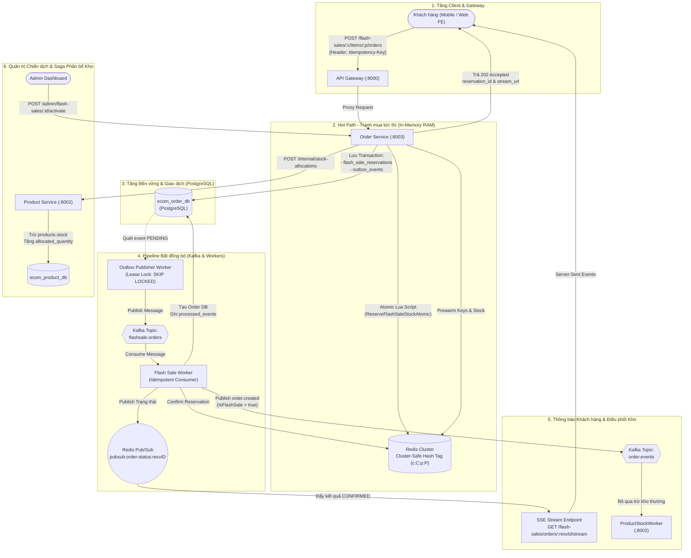

# ⚡ KIẾN TRÚC HỆ THỐNG FLASH SALE CHUẨN PRODUCTION
### High-Concurrency Distributed Flash Sale Engine (Golang, Redis Cluster, Kafka, PostgreSQL)

---

## 1. Trạng Thái Triển Khai Hệ Thống (Frontend & Backend)

### 1.1. Đã có trong Frontend (FE) chưa?
> **Tình trạng:** **ĐÃ HOÀN TẤT & TÍCH HỢP 100%**

* **Trang chủ (`frontend/src/features/flash-sale/components/flash-sale-section.tsx`)**:
  - Tự động gọi API `GET /flash-sales/active` để lấy chiến dịch đang diễn ra từ Backend.
  - Hiển thị đồng hồ đếm ngược (Countdown Timer) chính xác theo thời gian `ends_at` của chiến dịch thực tế.
  - Hiển thị thanh tiến độ kho và phần trăm đã bán (`sold_stock / allocated_stock`), kèm huy hiệu hạn mức (Deal sốc 1 suất / Mua tối đa N món).
* **Modal Đặt mua (`frontend/src/features/flash-sale/components/flash-sale-modal.tsx`)**:
  - Tự động sinh mã UUID v4 làm `Idempotency-Key` trong Header để chống duplicate khi click đúp.
  - Cho phép tùy chọn số lượng mua (nếu chiến dịch cho phép mua nhiều lần; khóa ở 1 nếu là Deal sốc).
  - Gửi request đến `POST /flash-sales/:campaignId/items/:productId/orders` (trả về 202 Accepted).
  - Kết nối trực tiếp đường truyền **Server-Sent Events (SSE)** `/flash-sales/orders/:reservationId/stream` nhận kết quả `CONFIRMED` realtime từ Redis Pub/Sub, kèm cơ chế polling fallback tự động.

---

### 1.2. Khi tạo 1 chiến dịch mới đã có chưa?
> **Tình trạng:** **ĐÃ CÓ ĐẦY ĐỦ Ở CẢ BACKEND VÀ GIAO DIỆN FRONTEND ADMIN**

* **Giao diện Quản trị Admin (`frontend/src/app/admin/flash-sales/page.tsx`)**:
  - Bảng điều khiển thống kê (Đang chạy, Bản nháp, Đã kết thúc) kèm bộ lọc trạng thái.
  - **Modal tạo chiến dịch mới trực quan**:
    - Nhập tên chiến dịch, thời gian bắt đầu (`starts_at`) và kết thúc (`ends_at`).
    - Chọn mã sản phẩm, giá sale, giá gốc, số lượng phân bổ (`allocated_stock`).
    - **Lựa chọn loại hạn mức**:
      - **Loại 1 (Deal sốc)**: Mỗi khách mua đúng 1 lần/1 món (`max_quantity_per_user: 1`).
      - **Loại 2 (Xả kho)**: Khách được mua nhiều lần qua nhiều đơn hàng đến hạn mức tích lũy N (`max_quantity_per_user: N`).
  - **Nút hành động ngay trên giao diện**:
    - **Kích hoạt Saga (Activate)**: Gọi `POST /admin/flash-sales/:id/activate` $\rightarrow$ Trừ kho thường `Product Service` và Prewarm RAM Redis.
    - **Nhân bản (Clone Campaign)**: Gọi `POST /admin/flash-sales/:id/clone` $\rightarrow$ Sao chép cấu hình sang đợt mới để khách mua lại mà không làm mất lịch sử cũ.
    - **Kết thúc (End Campaign)**: Gọi `POST /admin/flash-sales/:id/end` $\rightarrow$ Thu hồi tồn kho thừa về Product Service.

---

## 2. Sơ đồ Kiến trúc Tổng thể (High-Level Architecture)

Hệ thống được thiết kế theo mô hình **Hot-Path in-memory (RAM) & Async Background Processing**:
* **99% lượng tải** tranh mua (Peak Concurrency) được giải quyết và chặn đứng tức thì trong vài milli-giây tại tầng **Redis Cluster Lua Script**.
* Cơ sở dữ liệu quan hệ **PostgreSQL chỉ nhận đúng số lượng request đã giành được suất giữ chỗ**.



---

## 3. Chi tiết Các Thành phần Kỹ thuật Đã Xây dựng

### 3.1. Engine Redis Chống Bán Âm & Tương thích Redis Cluster (`pkg/redislock`)
1. **Hash Tag `{c:C:p:P}`**:
   - Tất cả các khóa liên quan đến một sản phẩm trong chiến dịch (stock, quota người dùng, hash reservations, expiry zset) đều chứa chung tiền tố `{c:C:p:P}` (ví dụ: `fs:{c:1:p:100}:stock`).
   - **Tác dụng**: Buộc Redis Cluster băm cùng một Hash Slot, cho phép thực thi Multi-Key Lua Script nguyên tử mà **không bị lỗi `CROSSSLOT Keys in request don't hash to the same slot`**.
2. **Loại bỏ Lệch đồng hồ phân tán (Clock Skew)**:
   - Lua script gọi trực tiếp `redis.call('TIME')` lấy thời gian của node Redis làm thước đo chuẩn, không phụ thuộc vào giờ hệ thống của các server web app lệch nhau.
3. **Cơ chế Hạn mức Linh hoạt (Hỗ trợ cả 2 loại nghiệp vụ)**:
   - **Loại 1 (`max_quantity_per_user = 1`)**: Kiểm tra `(reserved_qty + purchased_qty) + buy_qty <= 1`. Nếu đã giữ chỗ hoặc đã mua $\rightarrow$ Từ chối ngay với mã `ERR_MAX_LIMIT_EXCEEDED`.
   - **Loại 2 (`max_quantity_per_user = N`)**: Cho phép cùng 1 tài khoản mua nhiều lần qua nhiều đơn hàng nhỏ, miễn tổng số lượng tích lũy không vượt quá $N$. (Nếu đặt `0` là không giới hạn số lượng).
4. **Idempotency Fingerprint cấp độ IETF / Stripe**:
   - Khóa `fs:{c:C:p:P}:req:U:R` lưu kết quả kèm SHA-256 fingerprint nội dung đơn.
   - Gửi lại cùng ID và cùng nội dung $\rightarrow$ Trả kết quả cũ (an toàn khi rớt mạng).
   - Gửi lại cùng ID nhưng đổi nội dung $\rightarrow$ Báo lỗi `409 IDEMPOTENCY_KEY_REUSED`.

---

### 3.2. Saga Phân bổ Tồn kho 2 Pha & Database-per-Service
Tuân thủ nguyên tắc cách ly dữ liệu: `order-service` sở hữu `ecom_order_db`, `product-service` sở hữu `ecom_product_db`. Không dùng chung kết nối DB, không dùng 2PC nặng nề.

> **“2 pha” ở đây không phải Two-Phase Commit (2PC) của database.** Không có một transaction duy nhất khóa đồng thời cả hai DB. Đây là Saga do `Order Service` điều phối, gồm: (1) **chuẩn bị/cấp phát** kho cho toàn bộ sản phẩm và prewarm Redis ở trạng thái chưa bán; (2) **commit nghiệp vụ/công bố** campaign bằng cách chuyển DB rồi Redis sang `ACTIVE`. Khi một bước cấp phát Product Service thất bại, Saga chạy các API bồi hoàn idempotent để trả những phần kho đã cấp phát.

#### Vì sao cần Database-per-Service?

`Order Service` chỉ quản lý campaign, item, reservation và order; nó không được tự chạy câu SQL trừ `products.stock`. Ngược lại, chỉ `Product Service` được sửa kho sản phẩm và sổ cái phân bổ. Vì vậy mỗi bước chỉ có thể ACID **bên trong DB của service sở hữu dữ liệu**:

| Service | Dữ liệu sở hữu | Thay đổi nguyên tử cục bộ |
|---|---|---|
| Product Service | `products`, `product_stock_allocations` | Trừ kho thường và tạo allocation trong cùng transaction |
| Order Service | `flash_sale_campaigns`, `flash_sale_items`, reservations, outbox | Đổi trạng thái campaign hoặc lưu reservation + outbox trong transaction của Order DB |

Tính nhất quán xuyên hai service đạt được bằng `request_id` để retry an toàn, state machine của campaign và **compensating transaction** (giao dịch bồi hoàn), thay vì rollback SQL xuyên hai DB.

* **Sổ cái phân bổ (`product_stock_allocations`)**:
  - Nằm trong `ecom_product_db`.
  - Quản lý 3 trạng thái: `allocated_quantity` (đã cấp phát cho Flash Sale), `sold_quantity` (đã xuất đơn), `released_quantity` (hoàn trả về kho thường).
* **Quy trình Kích hoạt (Activation Saga)**:
  1. Admin gọi kích hoạt $\rightarrow$ `Order Service` chuyển trạng thái chiến dịch sang `ALLOCATING`.
  2. `Order Service` gọi API nội bộ `POST /internal/stock-allocations` sang `Product Service` để khóa kho thường chuyển sang kho Flash Sale.
  3. Nếu thành công: Nạp tồn kho và cấu hình lên RAM Redis $\rightarrow$ Lưu DB `ACTIVE` $\rightarrow$ Mở Redis `ACTIVE`.
  4. **Compensating Rollback (Bồi hoàn tự động)**: Nếu bất kỳ sản phẩm nào không đủ kho hoặc mạng lỗi, `Order Service` tự động gọi `POST /internal/stock-allocations/:campaignId/:productId/release` hoàn trả kho của những sản phẩm đã phân bổ trước đó, đưa trạng thái về `ACTIVATION_FAILED`.

#### Ví dụ thành công: campaign có hai sản phẩm

Giả sử campaign `C10` cần 30 sản phẩm `P1` và 20 sản phẩm `P2`; kho thường ban đầu lần lượt là 100 và 50.

```text
Order DB                         Product DB                         Redis
C10: DRAFT
   |
   +-- C10: ALLOCATING
   |
   +-- allocate(C10,P1,30) ----> P1.stock: 100 -> 70
   |                             ledger(C10,P1): allocated=30,
   |                                               sold=0, released=0
   |
   +-- allocate(C10,P2,20) ----> P2.stock: 50 -> 30
   |                             ledger(C10,P2): allocated=20,
   |                                               sold=0, released=0
   |
   +-- C10: PREWARMING ------------------------------------------> P1=30, P2=20,
   |                                                               state=PAUSED
   +-- C10: ACTIVE
   +-- open Redis ------------------------------------------------> state=ACTIVE
```

Redis chỉ là bộ máy giữ chỗ tốc độ cao. Nguồn sự thật lâu dài cho việc “bao nhiêu kho đã tách khỏi kho thường” vẫn là allocation ledger trong Product DB. Trạng thái `PAUSED` khi prewarm ngăn khách mua trong khoảng Redis đã có dữ liệu nhưng Order DB chưa commit `ACTIVE`.

#### Ví dụ thất bại và bồi hoàn

Vẫn campaign `C10`: cấp 30 chiếc `P1` thành công, nhưng `P2` chỉ còn 10 nên yêu cầu 20 chiếc thất bại.

```text
1. C10: DRAFT -> ALLOCATING
2. allocate P1 thành công: P1.stock 100 -> 70; ledger allocated=30
3. allocate P2 thất bại: không đủ kho
4. C10: ALLOCATING -> COMPENSATING
5. release(C10,P1): to_release = allocated - sold - released
                         = 30 - 0 - 0 = 30
   P1.stock 70 -> 100; ledger released=30
6. C10: COMPENSATING -> ACTIVATION_FAILED
```

Nếu response của bước 2 bị mất do timeout nhưng Product Service đã commit, retry vẫn dùng cùng khóa `alloc-camp-10-prod-1`; Product Service trả allocation cũ và **không trừ thêm 30**. Tương tự, gọi release lặp lại lần hai cho ledger đã release hết sẽ có `to_release = 0`, nên không cộng kho hai lần. Đây là lý do mỗi bước Saga phải idempotent.

State machine rút gọn:

```text
DRAFT -> ALLOCATING -> PREWARMING -> ACTIVE
             |
             +-> COMPENSATING -> ACTIVATION_FAILED
```

Một Saga không tạo ra tính nguyên tử tức thời như 2PC: trong thời gian ngắn có thể thấy P1 đã bị trừ kho còn campaign chưa `ACTIVE`. Trạng thái trung gian và quy trình retry/bồi hoàn khiến trạng thái đó có thể quan sát được nhưng không trở thành sai lệch vĩnh viễn.

> **Lưu ý về implementation hiện tại:** nhánh bồi hoàn trong `ActivateCampaign` hiện được gọi khi API allocation thất bại. Lỗi prewarm Redis mới chỉ được log rồi tiếp tục, và thao tác mở `ACTIVE` từng Redis item là best-effort. Muốn đạt đầy đủ cam kết “mọi lỗi trước khi công bố đều được phục hồi”, cần bổ sung retry/reconciliation cho Redis và bồi hoàn khi không thể hoàn tất prewarm; nếu không, một item có thể cần worker sửa lại trạng thái Redis sau crash.

* **Chống Trừ kho 2 lần**:
  - Khi đơn hàng Flash Sale được tạo xong, event `order.created` bắn ra Kafka mang cờ `IsFlashSale: true`.
  - `ProductStockWorker` (Product Service) kiểm tra cờ này và tự động bỏ qua trừ kho thường, triệt tiêu hoàn toàn rủi ro trừ kho 2 lần.

---

### 3.3. Transactional Outbox Pattern với Lease Lock
Giải quyết bài toán: *“Làm sao đảm bảo đơn hàng đã lưu vào DB thì chắc chắn Kafka sẽ nhận được sự kiện, ngay cả khi server bị crash đột ngột?”*

Vấn đề gốc là không thể commit nguyên tử một transaction PostgreSQL và một lần publish Kafka:

```text
Cách ngây thơ A: COMMIT DB -> crash -> chưa publish Kafka     (mất event)
Cách ngây thơ B: publish Kafka -> crash/rollback DB           (event không có dữ liệu tương ứng)
```

Outbox biến việc cần làm với Kafka thành một bản ghi nằm trong **chính transaction nghiệp vụ**. Sau commit, worker có thể publish ngay hoặc vài giây sau, nhưng event không bị quên.

1. **Giao dịch Kép Nguyên tử**: Lưu `flash_sale_reservations` và `outbox_events` trong cùng một Database Transaction tại PostgreSQL.
2. **Lease Lock không giữ DB Connection**:
   - `OutboxPublisherWorker` dùng `SELECT ... FOR UPDATE SKIP LOCKED` để lấy 50 event `PENDING`.
   - Cập nhật `locked_by = worker_id`, `locked_until = NOW() + 30s` và **COMMIT NGAY LẬP TỨC**.
   - Bắn Kafka ở ngoài transaction. Nhờ vậy connection pool của DB không bị nghẽn trong lúc chờ mạng Kafka.
   - Bắn thành công $\rightarrow$ Cập nhật `PUBLISHED`.
   - Gặp lỗi $\rightarrow$ Tăng `attempts`, tính Exponential Backoff cho `next_attempt_at`.

#### Ví dụ từ lúc khách giữ hàng đến Kafka

Khách giữ 2 sản phẩm, tạo reservation `FSR-123`. Trong **một transaction của Order DB**:

```sql
BEGIN;
INSERT INTO flash_sale_reservations (...) VALUES ('FSR-123', ..., 'RESERVED');
UPDATE flash_sale_items
SET reserved_stock = reserved_stock + 2
WHERE id = :item_id
  AND reserved_stock + sold_stock + 2 <= allocated_stock;
INSERT INTO outbox_events(id, event_type, aggregate_id, status, ...)
VALUES ('EVT-456', 'FLASH_SALE_RESERVED', 'FSR-123', 'PENDING', ...);
COMMIT;
```

- Nếu bất kỳ câu lệnh nào lỗi: cả reservation, counter và outbox đều rollback; Kafka không cần nhận gì.
- Nếu `COMMIT` thành công rồi process chết: `EVT-456` vẫn nằm trong DB; worker mới sẽ lấy và publish sau.
- Vì Kafka publish và `MarkPublished` vẫn là hai thao tác riêng, worker có thể publish thành công rồi chết trước khi đánh dấu. Khi lease hết hạn, event được publish lại. Do đó hệ thống có ngữ nghĩa **at-least-once**, và consumer phải idempotent bằng `event_id` như mục 3.4.

#### Lease lock hoạt động thế nào khi có nhiều worker?

Giả sử `W1` và `W2` cùng quét outbox:

```text
t=00  W1 khóa hàng EVT-456 bằng FOR UPDATE SKIP LOCKED
      W2 bỏ qua EVT-456 và claim event khác, không phải chờ W1
t=01  W1 ghi status=PROCESSING, locked_by=W1, locked_until=t+30s; COMMIT
t=02  W1 publish Kafka ở ngoài DB transaction
t=03  publish thành công -> status=PUBLISHED
```

`FOR UPDATE` chỉ được giữ trong transaction claim rất ngắn. Sau `COMMIT`, “quyền xử lý” không còn là row lock vật lý mà là **lease có thời hạn** biểu diễn bởi `locked_by/locked_until`; vì thế không giữ một DB connection trong lúc chờ Kafka.

Nếu `W1` chết ở `t=02`, event tạm ở `PROCESSING`. Sau `locked_until`, lần quét tiếp theo coi nó là stale và claim lại. Nếu Kafka đang lỗi, worker trả event về `PENDING`, tăng `attempts` và đặt `next_attempt_at` (ví dụ 1s, 2s, 4s, 8s...) để tránh retry dồn dập.

#### Outbox và Saga liên hệ với nhau ra sao?

Hai pattern giải quyết hai biên lỗi khác nhau:

| Pattern | Biên lỗi được xử lý | Cách phục hồi |
|---|---|---|
| Saga | Nhiều transaction/API giữa Order Service và Product Service | Retry bước idempotent hoặc gọi bước bồi hoàn |
| Transactional Outbox | Transaction Order DB và publish Kafka | Lưu ý định publish trong DB rồi worker retry bằng lease |

Ví dụ, Saga activation dùng API để tách kho; còn khi một reservation/order đã được commit, Outbox bảo đảm event tương ứng cuối cùng sẽ đến Kafka. Consumer phía Product Service dùng `event_id` để chống xử lý lặp, rồi cập nhật `sold_quantity`; ba cơ chế Saga + Outbox + Idempotent Consumer ghép lại thành luồng chịu được crash nhưng không cần shared database hay distributed transaction.

---

### 3.4. Idempotent Consumer (`processed_events`)
* Đảm bảo cơ chế tiêu thụ Kafka chính xác một lần về mặt nghiệp vụ (*Effectively-Once Processing*).
* Bảng `processed_events (consumer_name, event_id)` sử dụng cơ chế `INSERT ... ON CONFLICT DO NOTHING`.
* Nếu Kafka gửi lại tin nhắn cũ (At-least-once delivery) $\rightarrow$ Worker phát hiện đã xử lý và commit offset bỏ qua, không tạo đơn trùng.

---

### 3.5. Bộ đôi Workers Quét Hết hạn & Ghost Cleanup
* **`ReservationExpiryWorker`**:
  - Quét các đơn giữ chỗ quá thời hạn thanh toán (ví dụ: quá 120 giây chưa hoàn tất đặt hàng).
  - Tự động gọi Lua script `ReleaseReservationAtomic` trên Redis để nhả kho và quota, đồng thời cập nhật DB về `EXPIRED`.
* **`ReconciliationWorker` (Dọn dẹp giữ chỗ ma)**:
  - Nếu xảy ra sự cố hiếm gặp: Redis vừa giữ chỗ xong thì server sập điện trước khi kịp mở DB Transaction.
  - Worker quét Redis Expiry ZSet, phát hiện reservation ID quá hạn mà **không hề tồn tại trong PostgreSQL** $\rightarrow$ Tự động thu hồi và hoàn lại tồn kho trên Redis.

---

### 3.6. Thông báo Realtime SSE Stream & Polling Fallback
* Endpoint `/flash-sales/orders/:reservationId/stream`:
  - Trả về ngay Snapshot trạng thái hiện tại (giải quyết triệt để race condition: đơn được tạo quá nhanh trước khi client kịp mở kết nối SSE).
  - Lắng nghe Redis Pub/Sub kênh `pubsub:order-status:<reservationID>`.
  - Giữ kết nối với heartbeat ping định kỳ 15 giây.
  - Tự động ngắt kết nối khi đơn đạt trạng thái cuối (`CONFIRMED`, `CANCELLED`, `EXPIRED`).
* Endpoint `/flash-sales/orders/:reservationId`: Cho phép Web Client polling định kỳ để dự phòng nếu trình duyệt không hỗ trợ SSE hoặc mạng rớt.

---

## 4. Danh mục API Đã Xây dựng (API Catalog)

### 4.1. Admin APIs (Quản trị Chiến dịch)
| Method | Endpoint | Quyền hạn | Mô tả chức năng |
| :--- | :--- | :--- | :--- |
| `POST` | `/admin/flash-sales` | Admin | Tạo đợt Flash Sale (`name`, `starts_at`, `ends_at`) |
| `GET` | `/admin/flash-sales` | Admin | Danh sách đợt sale (phân trang, lọc theo trạng thái) |
| `GET` | `/admin/flash-sales/:campaignId` | Admin | Chi tiết đợt sale & danh sách sản phẩm |
| `POST` | `/admin/flash-sales/:campaignId/items` | Admin | Thêm sản phẩm, giá sale, kho phân bổ, quota `max_per_user` |
| `POST` | `/admin/flash-sales/:campaignId/activate` | Admin | Kích hoạt Saga phân bổ kho & Prewarm Redis |
| `POST` | `/admin/flash-sales/:campaignId/clone` | Admin | **Nhân bản đợt sale** sang campaign mới sạch sẽ |
| `POST` | `/admin/flash-sales/:campaignId/end` | Admin | Kết thúc sale sớm & hoàn trả kho thừa về Product Service |

### 4.2. Internal APIs (Giao tiếp Nội bộ Microservices)
| Method | Endpoint | Gọi từ | Mô tả chức năng |
| :--- | :--- | :--- | :--- |
| `POST` | `/internal/stock-allocations` | Order Service | Khóa tồn kho thường, ghi nhận sổ cái phân bổ |
| `POST` | `/internal/stock-allocations/:c/:p/release` | Order Service | Hoàn trả tồn kho Flash Sale về lại kho thường |

### 4.3. Customer APIs (Khách hàng Đặt mua)
| Method | Endpoint | Quyền hạn | Mô tả chức năng |
| :--- | :--- | :--- | :--- |
| `POST` | `/flash-sales/:campaignId/items/:productId/orders` | Customer | Đặt mua Flash Sale (kèm `Idempotency-Key` header) |
| `GET` | `/flash-sales/orders/:reservationId` | Customer | Kiểm tra trạng thái đơn hàng (đọc từ RAM Redis) |
| `GET` | `/flash-sales/orders/:reservationId/stream` | Customer | Mở kết nối SSE nhận kết quả realtime |

---

## 5. Kết quả Kiểm thử Tự động (Test Results)

Hệ thống đã được kiểm thử toàn diện từ Unit Test đến Concurrency Stress Test:

1. **Redis Engine Test (`pkg/redislock`)**:
   - `TestFlashSaleEngine_BasicReserveConfirmRelease`: PASS
   - `TestFlashSaleEngine_MultiplePurchasesQuota`: PASS (Xác thực người dùng mua nhiều lần đạt hạn mức thì chặn)
   - `TestFlashSaleEngine_Concurrency_ZeroOversell`: PASS (**50 goroutines tranh mua đồng thời 10 suất $\rightarrow$ Đúng 10 người được mua, 40 người bị từ chối, Tồn kho âm = 0**)
2. **Product Stock Allocation Test (`product-service`)**:
   - `TestStockAllocation_AllocateAndRelease`: PASS
   - `TestStockAllocation_InsufficientStock`: PASS
3. **Flash Sale Service & Saga Test (`order-service`)**:
   - `TestFlashSaleService_CreateAndActivateCampaign`: PASS
   - `TestFlashSaleService_ActivateCompensatingSaga`: PASS (Mô phỏng lỗi và xác thực rollback bồi hoàn thành công)
4. **Kịch bản E2E Shell Script (`test_flash_sale.sh`)**:
   - Sinh 15 JWT Tokens độc lập cho 15 tài khoản thật.
   - Tạo chiến dịch và nạp 5 suất hàng.
   - Bắn 15 request đồng thời qua API Gateway.
   - Xác thực đúng 5 đơn 202 Accepted, 10 đơn 409 Sold Out, 0 đơn bị bán âm.

---

## 6. Kế hoạch Tích hợp Frontend Tiếp theo (Frontend Integration Roadmap)

Để đưa toàn bộ hệ thống này lên giao diện Web cho người dùng và Admin, chúng ta cần triển khai 4 bước sau:

1. **Bổ sung API Public lấy Campaign đang hoạt động**:
   - Thêm `GET /flash-sales/active` ở Backend (trả về Campaign đang `ACTIVE` kèm danh sách items, giá sale, countdown timer `ends_at`).
2. **Nâng cấp `FlashSaleSection` (`frontend/src/features/flash-sale`)**:
   - Thay thế việc cắt tạm 4 sản phẩm tĩnh (`products.slice(0, 4)`) bằng việc fetch dữ liệu từ `GET /flash-sales/active`.
   - Hiển thị đồng hồ đếm ngược (Countdown Timer) chính xác theo thời gian kết thúc của chiến dịch.
3. **Nâng cấp `FlashSaleModal` & `order-service.ts`**:
   - Khi bấm nút "Mua ngay":
     - Tạo mã `Idempotency-Key` (bằng thư viện `crypto.randomUUID()`).
     - Gửi `POST /flash-sales/:campaignId/items/:productId/orders`.
     - Nhận về `reservation_id` (trạng thái 202 Accepted).
     - Mở kết nối `EventSource` tới `/flash-sales/orders/:reservationId/stream` để hiển thị spinner và cập nhật ngay lập tức sang màn hình Đặt hàng thành công khi nhận được event `CONFIRMED`.
4. **Xây dựng Màn hình Admin Quản trị Chiến dịch (`/admin/flash-sales`)**:
   - Giao diện danh sách các chiến dịch Flash Sale (Đang chạy, Đã lên lịch, Đã kết thúc).
   - Form tạo chiến dịch mới: chọn thời gian, chọn sản phẩm, nhập số lượng phân bổ, chọn loại hạn mức (1 lần / nhiều lần).
   - Nút hành động: "Kích hoạt (Activate)", "Nhân bản (Clone)", "Kết thúc (End)".
