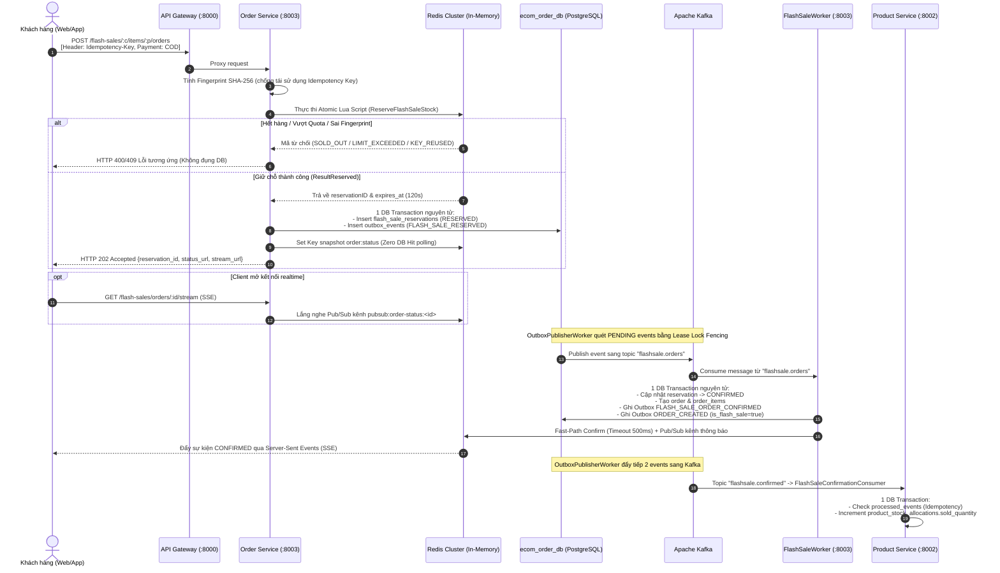
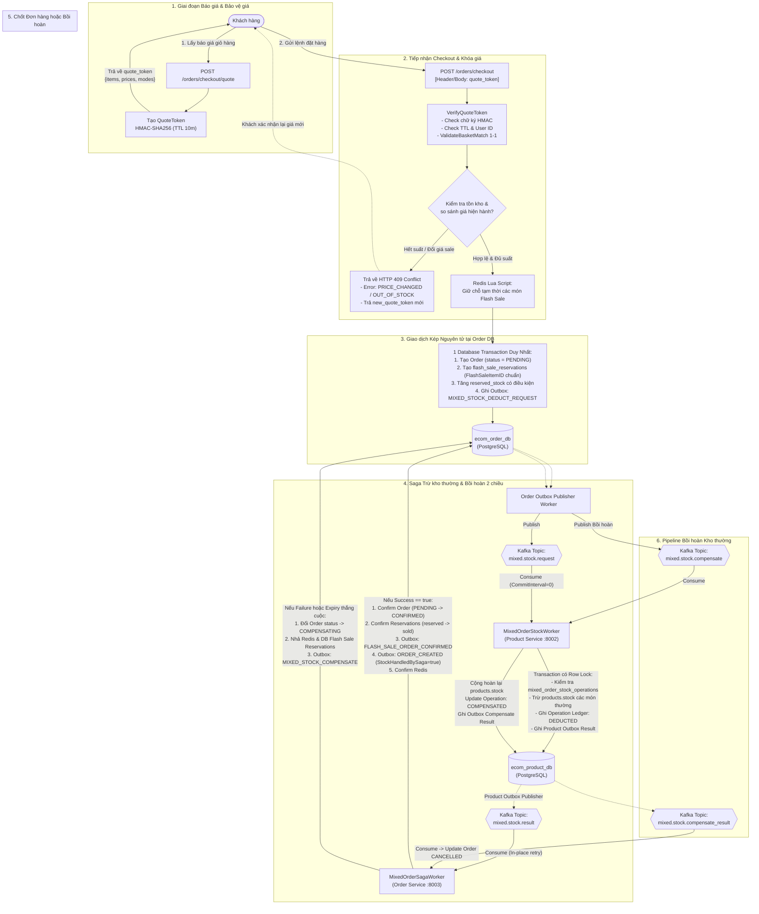

# ⚡ KIẾN TRÚC HỆ THỐNG FLASH SALE TOÀN DIỆN (PRODUCTION-GRADE)
### High-Concurrency Distributed Flash Sale & Mixed-Cart Engine (Golang, Redis Cluster, Apache Kafka, PostgreSQL)

---

## 1. Tổng Quan: Hai Mô Hình Flash Sale Trong Hệ Thống

Hệ thống E-Commerce hiện tại hỗ trợ song song **2 luồng đặt hàng Flash Sale** độc lập, đáp ứng hai hành vi người dùng hoàn toàn khác nhau:

```
                                  ┌─────────────────────────────────────────────────────────────┐
                                  │            HỆ THỐNG FLASH SALE E-COMMERCE                   │
                                  └──────────────┬───────────────────────────────┬──────────────┘
                                                 │                               │
                      ┌──────────────────────────┴──────────┐ ┌──────────────────┴──────────────────────────┐
                      │  LUỒNG 1: STANDALONE HOT-PATH       │ │  LUỒNG 2: MIXED-CART CHECKOUT               │
                      │  (Mua ngay 1 chạm / Tranh mua)      │ │  (Giỏ hàng hỗn hợp Flash Sale + Hàng thường)│
                      ├─────────────────────────────────────┤ ├─────────────────────────────────────────────┤
                      │ • API: POST /flash-sales/:c/:p/orders│ │ • API: POST /orders/checkout               │
                      │ • Mua tức thì 1 sản phẩm từ Banner  │ │ • Mua nhiều món từ giỏ hàng                │
                      │ • Xử lý: 100% In-Memory RAM Redis   │ │ • Báo giá trước bằng Quote Token (HMAC)    │
                      │ • Chống bán âm bằng Redis Lua Script│ │ • Bảo vệ giá bằng mã lỗi HTTP 409 Re-Quote  │
                      │ • Phản hồi: HTTP 202 Accepted       │ │ • Phân tán: Saga Choreography 2 chiều      │
                      │ • Nhận kết quả: Realtime SSE Stream │ │ • Quản lý kho thường bằng Operation Ledger  │
                      │ • Phương thức TT: COD-Only          │ │ • Phương thức TT: COD-Only (nếu có FS item) │
                      └─────────────────────────────────────┘ └─────────────────────────────────────────────┘
```

| Đặc điểm so sánh | Luồng 1: Standalone Hot-Path (Tranh mua) | Luồng 2: Mixed-Cart Checkout (Giỏ hàng hỗn hợp) |
| :--- | :--- | :--- |
| **Hành vi người dùng** | Click nút "Mua ngay" trên modal/banner Flash Sale | Bỏ nhiều món (cả Flash Sale và hàng thường) vào giỏ rồi bấm Thanh toán |
| **Endpoint tiếp nhận** | `POST /flash-sales/:campaignId/items/:productId/orders` | `POST /orders/checkout` (kèm header / body `quote_token`) |
| **Cơ chế kiểm soát giá** | Trực tiếp từ cấu hình chiến dịch Flash Sale đang Active | **Quote Token HMAC-SHA256** (bắt buộc ký trước qua `POST /orders/checkout/quote`) |
| **Khi hết suất / đổi giá** | Báo lỗi ngay lập tức (`400/409 FLASH_SALE_OUT_OF_STOCK`) | **HTTP 409 Conflict**: Trả về `new_quote_token` và danh sách món đổi giá, không âm thầm tính giá thường |
| **Tầng giữ chỗ ban đầu** | Atomic Redis Lua Script (`ReserveFlashSaleStock`) | Atomic Redis Lua Script cho từng món Flash Sale |
| **Tầng lưu trữ bền vững** | Lưu `flash_sale_reservations` (RESERVED) + Outbox `FLASH_SALE_RESERVED` | Lưu `Order` (PENDING/CONFIRMED) + `flash_sale_reservations` + Outbox trong 1 Transaction |
| **Đồng bộ kho thường** | Không liên quan (chỉ trừ kho phân bổ Flash Sale) | **Saga Choreography**: Gửi `mixed.stock.request` sang Product Service có Operation Ledger |
| **Phản hồi Client** | `202 Accepted` $\rightarrow$ Nhận kết quả qua **SSE Stream** / Polling | `201 Created` (Order PENDING/CONFIRMED) $\rightarrow$ Polling trạng thái đơn hàng |

---

## 2. Kiến Trúc Chi Tiết Luồng 1: Standalone Hot-Path (Tranh Mua Siêu Tốc)

Luồng này được tối ưu hóa để chịu tải hàng chục nghìn lượt truy cập đồng thời (Peak Concurrency) trong những giây đầu mở bán Flash Sale. 99% lượng truy cập bị chặn đứng an toàn tại RAM Redis.

### 2.1. Sơ đồ luồng xử lý (Sequence Diagram)



### 2.2. Điểm kỹ thuật cốt lõi của Luồng 1

1. **Redis Hash Tag `{c:C:p:P}`**:
   - Tất cả các khóa liên quan tới một mặt hàng sale (`fs:{c:1:p:100}:stock`, `fs:{c:1:p:100}:user:U:resv`, `fs:{c:1:p:100}:req:U:R`) đều mang chung Hash Tag.
   - Giúp Redis Cluster gom toàn bộ dữ liệu vào chung một Hash Slot, thực thi Multi-Key Lua Script nguyên tử mà không bị lỗi `CROSSSLOT`.
2. **Loại bỏ Lệch đồng hồ phân tán (Clock Skew)**:
   - Lua script gọi trực tiếp `redis.call('TIME')` lấy thời gian của node Redis làm chuẩn, không phụ thuộc vào giờ hệ thống của các server web app.
3. **Idempotency Fingerprint cấp độ IETF/Stripe**:
   - Tránh việc người dùng dùng cùng 1 `Idempotency-Key` nhưng gửi 2 body khác nhau. Nếu trùng key và đúng fingerprint: trả về kết quả cũ; nếu đổi nội dung: trả về `409 IDEMPOTENCY_KEY_REUSED`.
4. **Fast-Path kết hợp Safety Net (Tấm lưới an toàn)**:
   - Sau khi ghi DB thành công, `FlashSaleWorker` gọi fast-path cập nhật Redis với strict timeout 500ms.
   - Nếu Redis lag hoặc timeout: `FlashSaleProjectionWorker` độc lập lắng nghe topic `flashsale.confirmed` để cập nhật lại Redis bất đồng bộ, bảo đảm không bao giờ lệch trạng thái.

---

## 3. Kiến Trúc Chi Tiết Luồng 2: Mixed-Cart Checkout (Giỏ Hàng Hỗn Hợp)

Đây là luồng phức tạp nhất trong hệ thống E-Commerce: Người dùng có thể bỏ vào giỏ **cả hàng Flash Sale lẫn hàng thường**, hưởng trọn giá ưu đãi nếu còn suất, và được bảo vệ tuyệt đối về giá nếu có biến động tồn kho.

### 3.1. Vấn đề cốt lõi cần giải quyết ở Giỏ Hàng Hỗn Hợp
* **Vấn đề 1: Trượt giá âm thầm (Silent Price Drift)**: Khách thấy giá Flash Sale 100k, nhưng lúc bấm checkout thì suất sale vừa hết. Nếu hệ thống tự ý tính giá thường 200k và trừ tiền khách thì sẽ vi phạm nghiêm trọng trải nghiệm người dùng.
* **Vấnnet 2: Phân tán tồn kho (Dual Stock Domain)**: Hàng thường thuộc quản lý của `ecom_product_db` (`products.stock`), còn hàng Flash Sale thuộc quản lý của `ecom_order_db` (`flash_sale_items`) và sổ cái phân bổ `product_stock_allocations`. Hai database riêng biệt không thể dùng chung 1 SQL transaction!
* **Vấn đề 3: Đua thời gian (Race Condition) giữa Expiry và Late Success**: Suất Flash Sale hết hạn giữ chỗ (ví dụ sau 5 phút) khiến Order Service hủy đơn, nhưng ngay lúc đó Product Service lại gửi thông báo trừ kho thường thành công tới muộn. Nếu không có bồi hoàn tự động, kho thường sẽ bị trừ oan vĩnh viễn!

### 3.2. Sơ đồ Kiến trúc Toàn diện của Mixed-Cart Checkout



### 3.3. Các bước xử lý chi tiết trong Luồng Mixed-Cart

#### Bước 1: Giai đoạn Báo giá & Khóa giá bằng Quote Token (`QuoteToken`)
* Khách hàng mở trang Checkout giỏ hàng $\rightarrow$ Frontend gọi `POST /orders/checkout/quote`.
* Order Service kiểm tra trạng thái chiến dịch Flash Sale:
  - Nếu món hàng đang có Flash Sale và khách còn quota: Đánh dấu `PurchaseMode = "FLASH_SALE"`, gán giá ưu đãi.
  - Nếu món hàng không sale hoặc đã hết suất: Đánh dấu `PurchaseMode = "REGULAR"`, gán giá thường.
* Backend dùng secret an toàn ($\ge 16$ ký tự) ký mã `QuoteToken` qua thuật toán **HMAC-SHA256**:
  ```json
  {
    "user_id": "usr-123456",
    "issued_at": 1726500000,
    "expires_at": 1726500600,
    "total": 350000,
    "items": [
      { "product_id": 10, "quantity": 1, "quoted_price": 99000, "purchase_mode": "FLASH_SALE" },
      { "product_id": 25, "quantity": 2, "quoted_price": 125500, "purchase_mode": "REGULAR" }
    ]
  }
  ```
* Trả token về cho Frontend lưu trong bộ nhớ phiên làm việc.

#### Bước 2: Tiếp nhận Checkout & Giao thức Xung đột giá (HTTP 409 Re-Quote)
* Khi khách bấm "Đặt hàng", request gửi lên `POST /orders/checkout` bắt buộc phải kèm `quote_token`.
* **Xác thực Quote (`VerifyQuoteToken`)**:
  - Kiểm tra tính toàn vẹn của chữ ký HMAC.
  - Kiểm tra thời hạn hiệu lực (`expires_at`, mặc định 10 phút).
  - Kiểm tra quyền sở hữu (`payload.UserID == authenticated_user_id`).
  - So khớp 1-1 danh sách sản phẩm và số lượng gửi lên giỏ hàng (`ValidateBasketMatch`).
* **Kiểm tra biến động giá & suất sale hiện hành**:
  - Nếu một món được quote là `REGULAR`: Giữ nguyên chế độ giá thường, **tuyệt đối không check lại Flash Sale** (để tránh lặp lỗi 409 vô tận khi campaign sale còn chạy nhưng khách đã mua giá thường).
  - Nếu một món được quote là `FLASH_SALE` nhưng hiện tại:
    - Suất Flash Sale đã bị người khác mua hết (`remaining < quantity`).
    - Khách hàng đã đạt giới hạn mua tối đa (`resv + purchased + qty > max_per_user`).
    - Chiến dịch sale đã hết giờ (`FLASH_SALE_EXPIRED`).
    - Giá bán Flash Sale bị quản trị viên điều chỉnh tăng (`PRICE_CHANGED`).
* **Phản hồi HTTP 409 Conflict**:
  - Hệ thống **từ chối tạo đơn**, không âm thầm chuyển sang giá gốc.
  - Trả về mã lỗi `PRICE_CHANGED` hoặc `FLASH_SALE_OUT_OF_STOCK` kèm:
    - Danh sách các món bị ảnh hưởng và lý do thay đổi (`affected_items`).
    - Một `new_quote_token` mới tương ứng với giá thực tế tại thời điểm hiện tại.
  - Giao diện Frontend hiển thị hộp thoại cảnh báo: *"Một số sản phẩm đã hết suất Flash Sale hoặc thay đổi giá. Bạn có đồng ý đặt hàng với giá mới [Tổng tiền mới] không?"*. Chỉ khi khách bấm xác nhận, request mới được gửi lại với `new_quote_token`.

#### Bước 3: Giữ chỗ Redis & Giao dịch Kép Nguyên tử tại Order DB
* Sau khi giá và giỏ hàng hoàn toàn hợp lệ:
  - Với từng món Flash Sale, hệ thống gọi `redislock.ReserveFlashSaleStock` giữ chỗ trên RAM Redis (TTL 5 phút). Nếu bất kỳ món nào thất bại, hệ thống tự động nhả kho các món đã giữ trước đó trên Redis.
* Mở **1 Database Transaction duy nhất** tại `ecom_order_db`:
  1. Tạo bản ghi `orders` với trạng thái `PENDING` (hoặc `CONFIRMED` nếu đơn 100% là Flash Sale).
  2. Tạo bản ghi `flash_sale_reservations` cho từng món sale với **`FlashSaleItemID` chính xác** (trỏ vào ID của dòng `flash_sale_items`, không phải campaign ID).
  3. Tăng `reserved_stock` có điều kiện trên bảng `flash_sale_items`:
     ```sql
     UPDATE flash_sale_items
     SET reserved_stock = reserved_stock + :qty
     WHERE id = :item_id AND campaign_id = :campaign_id
       AND reserved_stock + sold_stock + :qty <= allocated_stock;
     ```
     Nếu `RowsAffected == 0` $\rightarrow$ Rollback transaction ngay, đảm bảo không bao giờ vượt hạn mức phân bổ.
  4. Nếu trong đơn có sản phẩm thường: Ghi bản ghi vào bảng `outbox_events` mang sự kiện `MIXED_STOCK_DEDUCT_REQUEST` (topic `mixed.stock.request`).
  5. Nếu đơn 100% Flash Sale (không có hàng thường): Xác nhận đơn `CONFIRMED`, gọi `ConfirmReservationDB`, ghi outbox `FLASH_SALE_ORDER_CONFIRMED` và `ORDER_CREATED`.
* Nếu Transaction DB gặp lỗi: Tự động gọi `ReleaseFlashSaleReservation` nhả toàn bộ kho Redis.

#### Bước 4: Saga Trừ kho thường có Operation Ledger (Product Service)
* `OutboxPublisherWorker` chuyển event từ bảng `outbox_events` sang Kafka topic `mixed.stock.request`.
* `MixedOrderStockWorker` (Product Service) lắng nghe topic này:
  - Sử dụng **Synchronous Commit (`CommitInterval: 0`)** và **In-place Retry Loop**: Nếu gặp lỗi DB/mạng tạm thời, worker retry lại đúng message đó, tuyệt đối không commit bỏ qua message lỗi.
  - Mở một Transaction tại `ecom_product_db` với khóa hàng `SELECT ... FOR UPDATE` trên bảng sổ cái `mixed_order_stock_operations` theo `order_id`:
    - **Nếu operation đã ở trạng thái `DEDUCTED`**: Trả lại kết quả thành công đã lưu (Idempotency), không trừ kho lần 2.
    - **Nếu operation đã ở trạng thái `COMPENSATED` hoặc `CANCELLED_BEFORE_DEDUCT`** (do lệnh hủy/bồi hoàn đến trước yêu cầu trừ kho): Tuyệt đối không trừ kho, trả về kết quả hủy.
    - **Nếu chưa xử lý**: Kiểm tra tồn kho `products.stock` của tất cả các món thường trong đơn:
      - Đủ kho: Trừ `products.stock`, cập nhật operation thành `DEDUCTED`, ghi Outbox `MIXED_STOCK_DEDUCT_RESULT` (success = true).
      - Thiếu kho: Không trừ bất kỳ món nào, cập nhật operation thành `FAILED`, ghi Outbox `MIXED_STOCK_DEDUCT_RESULT` (success = false).
* `ProductOutboxPublisherWorker` đẩy kết quả sang topic `mixed.stock.result`.

#### Bước 5: Hoàn tất Đơn hàng hoặc Kích hoạt Bồi hoàn (MixedOrderSagaWorker)
* `MixedOrderSagaWorker` (Order Service) lắng nghe topic `mixed.stock.result`:
  - **Trường hợp Trừ kho thành công (`Success == true`)**:
    - Kiểm tra thời hạn các reservation Flash Sale: Nếu còn hạn $\rightarrow$ Chạy 1 Transaction: Cập nhật order `PENDING -> CONFIRMED`, chuyển `reserved_stock` sang `sold_stock`, ghi Outbox `FLASH_SALE_ORDER_CONFIRMED` (để Product Service tăng `sold_quantity`) và Outbox `ORDER_CREATED`. Xác nhận trạng thái trên Redis.
    - **Xử lý Đua thời gian (Race Condition - Late Success)**: Nếu trước đó `ReservationExpiryWorker` đã quét thấy reservation Flash Sale hết hạn và đã cập nhật đơn thành `CANCELLED`, nhưng thông báo thành công của kho thường bây giờ mới tới:
      $\rightarrow$ Worker phát hiện `order.OrderStatus == CANCELLED`, lập tức gọi hàm `compensateLateSuccess`, phát Outbox bồi hoàn `mixed.stock.compensate` sang Product Service để hoàn trả kho thường, triệt tiêu hoàn toàn rủi ro giam kho!
  - **Trường hợp Trừ kho thất bại (`Success == false`) HOẶC Reservation Flash Sale hết hạn**:
    - Chuyển trạng thái đơn sang `COMPENSATING` (nếu có món thường cần hoàn) hoặc `CANCELLED`.
    - Nhả toàn bộ reservation Flash Sale trong DB và Redis.
    - Phát Outbox `mixed.stock.compensate` sang topic `mixed.stock.compensate`.
    - Product Service tiêu thụ message bồi hoàn, cộng lại `products.stock`, cập nhật operation thành `COMPENSATED`, phát về `mixed.stock.compensate_result`.
    - Order Service nhận kết quả bồi hoàn, hoàn tất chuyển trạng thái đơn sang `CANCELLED`.

---

## 4. Hàng Rào Bảo Vệ Tồn Kho: Drain Barrier & Settlement Barrier (`EndCampaign`)

Khi một chiến dịch Flash Sale kết thúc (do hết giờ hoặc do Admin bấm "Kết thúc"), hệ thống áp dụng cơ chế bảo vệ 2 tầng nghiêm ngặt trước khi thu hồi tồn kho thừa:

```
[Bấm End Campaign] ──> Chuyển trạng thái ENDING ──> Khóa Redis (state = ENDED)
                               │
                               ▼
            ┌──────────────────────────────────────┐
            │       TẦNG 1: DRAIN BARRIER          │
            │  Kiểm tra: ReservedStock == 0 ?      │
            └──────────────────┬───────────────────┘
                               │
                ┌──────────────┴──────────────┐
             (Còn > 0)                     (Bằng 0)
                │                             │
                ▼                             ▼
        [TỪ CHỐI END]              ┌──────────────────────────────────────┐
   Chờ các đơn hỗn hợp             │     TẦNG 2: SETTLEMENT BARRIER       │
   hoàn tất hoặc hết hạn           │  Kiểm tra: Product.sold == Order.sold│
                                   └──────────────────┬───────────────────┘
                                                      │
                                       ┌──────────────┴──────────────┐
                                    (Khớp ==)                     (Chưa khớp < hoặc >)
                                       │                             │
                                       ▼                             ▼
                           [GỌI RELEASE STOCK]              Nếu <: Chờ consumer đuổi kịp
                           SELECT ... FOR UPDATE            Nếu >: Báo lỗi Ledger Discrepancy
                           Cộng kho thừa vào products.stock Giữ nguyên ENDING để rà soát
                                       │
                                       ▼
                              [CHUYỂN SANG ENDED]
```

1. **Drain Barrier (Hàng rào xả cạn suất giữ chỗ)**:
   - Hệ thống quét từng sản phẩm trong chiến dịch: Nếu `ReservedStock > 0`, lập tức **từ chối kết thúc chiến dịch**.
   - **Mục đích**: Bảo vệ quyền lợi của những khách hàng đang trong tiến trình checkout giỏ hàng hỗn hợp (Saga đang chạy). Không được phép thu hồi kho khi giao dịch phân tán chưa ngã ngũ.
2. **Settlement Barrier (Hàng rào chốt sổ cái)**:
   - Hệ thống đối soát số lượng bán giữa 2 database:
     - `ProductDB.sold_quantity` (do `FlashSaleConfirmationConsumer` cập nhật).
     - `OrderDB.sold_stock` (số lượng thực tế đã tạo đơn thành công).
   - **Điều kiện chốt sổ**: Phải đạt tính tương đương chính xác `ProductDB.sold_quantity == OrderDB.sold_stock`.
   - Nếu `ProductDB.sold_quantity < OrderDB.sold_stock`: Consumer Kafka đang bị chậm (Lag), hệ thống retry tối đa 5 lần (mỗi lần chờ 500ms) để chờ consumer ghi nhận xong.
   - Nếu `ProductDB.sold_quantity > OrderDB.sold_stock`: Phát hiện bất thường dữ liệu (Ledger Discrepancy), giữ nguyên trạng thái `ENDING` và gửi cảnh báo để kỹ sư kiểm tra.
3. **Thu hồi kho an toàn (`ReleaseStock`)**:
   - Khi hai barrier đã thông suốt, Order Service gọi nội bộ sang Product Service:
     $$\text{to\_release} = \text{allocated\_quantity} - \text{sold\_quantity} - \text{released\_quantity}$$
   - Thực thi trong Transaction với `SELECT ... FOR UPDATE` trên bảng `product_stock_allocations`.
   - Cộng trả $\text{to\_release}$ vào `products.stock`, cập nhật `released_quantity`.
   - Cuối cùng mới chuyển chiến dịch sang trạng thái `ENDED`.

---

## 5. Hợp Đồng Tồn Kho & Chống Trừ Kho Hai Lần (Inventory Contract)

Nhằm giải quyết triệt để rủi ro một sản phẩm bị trừ kho 2 lần trên các topic Kafka khác nhau:

* Khi đơn hàng có chứa Flash Sale hoặc đã qua Saga hỗn hợp được tạo thành công, sự kiện `ORDER_CREATED` bắn lên topic `order.events` mang 2 cờ định danh:
  - `IsFlashSale: true`
  - `StockHandledBySaga: true`
* **Worker xử lý kho thường (`ProductStockWorker`)**:
  ```go
  if payload.IsFlashSale || payload.StockHandledBySaga {
      // Bỏ qua không trừ kho thường, vì:
      // - Hàng Flash Sale đã trừ từ kho phân bổ (product_stock_allocations)
      // - Hàng thường trong đơn hỗn hợp đã được trừ bởi MixedOrderStockWorker
      return
  }
  ```
* Hợp đồng này phân định rõ ràng: Sự kiện `ORDER_CREATED` đối với các đơn hàng này chỉ phục vụ mục đích thông báo downstream (gửi email hóa đơn, phân tích số liệu), không can thiệp vào tồn kho vật lý.

---

## 6. Danh Mục API Đầy Đủ (API Catalog)

### 6.1. Admin APIs (Quản trị Chiến dịch Flash Sale)
| Method | Endpoint | Quyền hạn | Mô tả chức năng |
| :--- | :--- | :--- | :--- |
| `POST` | `/admin/flash-sales` | Admin | Tạo chiến dịch mới (`name`, `starts_at`, `ends_at`) |
| `GET` | `/admin/flash-sales` | Admin | Danh sách chiến dịch (phân trang, lọc theo status) |
| `GET` | `/admin/flash-sales/:campaignId` | Admin | Chi tiết chiến dịch & danh sách sản phẩm phân bổ |
| `POST` | `/admin/flash-sales/:campaignId/items` | Admin | Thêm sản phẩm, giá sale, kho phân bổ, quota `max_per_user` |
| `POST` | `/admin/flash-sales/:campaignId/activate` | Admin | Kích hoạt Saga phân bổ kho & Prewarm Redis (Resumable) |
| `POST` | `/admin/flash-sales/:campaignId/clone` | Admin | **Nhân bản chiến dịch** sang đợt mới sạch sẽ |
| `POST` | `/admin/flash-sales/:campaignId/end` | Admin | Kết thúc có **Drain Barrier & Settlement Barrier** |

### 6.2. Customer APIs (Khách hàng Đặt mua)
| Method | Endpoint | Quyền hạn | Mô tả chức năng |
| :--- | :--- | :--- | :--- |
| `GET` | `/flash-sales/active` | Public | Lấy chiến dịch đang diễn ra kèm thời gian đếm ngược thực tế |
| `GET/POST` | `/flash-sales/offers/batch` | Public / User | Tra cứu ưu đãi giá Flash Sale & quota khả dụng theo danh sách ID sản phẩm |
| `GET` | `/flash-sales/offers/:productId` | Public / User | Tra cứu ưu đãi của một sản phẩm đơn lẻ |
| `POST` | `/flash-sales/:campaignId/items/:productId/orders` | Customer | **Luồng 1 (Hot-Path)**: Đặt mua ngay 1 chạm (COD-only, Idempotency-Key) |
| `GET` | `/flash-sales/orders/:reservationId` | Customer | Kiểm tra trạng thái giữ chỗ (đọc từ RAM Redis Snapshot) |
| `GET` | `/flash-sales/orders/:reservationId/stream` | Public | Mở kết nối **Server-Sent Events (SSE)** nhận kết quả realtime |

### 6.3. Mixed-Cart APIs (Giỏ Hàng Hỗn Hợp)
| Method | Endpoint | Quyền hạn | Mô tả chức năng |
| :--- | :--- | :--- | :--- |
| `POST` | `/orders/checkout/quote` | Customer | **Lấy báo giá chính xác cho giỏ hàng**, ký số sinh `QuoteToken` HMAC (TTL 10m) |
| `POST` | `/orders/checkout` | Customer | **Luồng 2 (Mixed Checkout)**: Đặt hàng giỏ hàng (bắt buộc `quote_token`, hỗ trợ trả lỗi 409 Re-Quote) |
| `POST` | `/orders/direct` | Customer | Đặt hàng trực tiếp từ giỏ/sản phẩm thường |

### 6.4. Internal APIs (Giao tiếp Nội bộ Microservices)
| Method | Endpoint | Gọi từ | Mô tả chức năng |
| :--- | :--- | :--- | :--- |
| `POST` | `/internal/stock-allocations` | Order Service | Khóa tồn kho thường, ghi nhận sổ cái phân bổ Flash Sale |
| `GET` | `/internal/stock-allocations/:c/:p` | Order Service | Truy vấn sổ cái phân bổ (dùng cho Settlement Barrier) |
| `POST` | `/internal/stock-allocations/:c/:p/release` | Order Service | Hoàn trả tồn kho Flash Sale thừa về lại kho thường (`FOR UPDATE`) |

---

## 7. Ma Trận Xử Lý Lỗi Phân Tán & Độ Bền Vững (Fault Tolerance)

| Tình huống sự cố | Cơ chế xử lý bảo đảm tính nhất quán |
| :--- | :--- |
| **Khách gửi request 2 lần liên tiếp (Click đúp)** | Khóa Idempotency trên Redis chặn đứng request trùng lặp; fingerprint SHA-256 ngăn việc tráo đổi body request. |
| **Giá thay đổi hoặc hết suất sale lúc đang checkout** | Trả về `HTTP 409 Conflict` kèm `new_quote_token`; buộc người dùng xác nhận lại giá mới, không âm thầm tính tiền sai. |
| **Order Service crash sau khi giữ chỗ Redis nhưng chưa ghi DB** | `ReconciliationWorker` quét Redis Expiry ZSet, phát hiện reservation ma không có trong PostgreSQL $\rightarrow$ Tự động nhả kho trên Redis. |
| **Order Service crash ngay sau khi commit DB nhưng chưa gửi Kafka** | Transactional Outbox Pattern với `SELECT ... FOR UPDATE SKIP LOCKED` và Lease Ownership Fencing đảm bảo event luôn được publish khi service sống lại. |
| **Kafka gửi lại message nhiều lần (At-least-once Delivery)** | Bảng `processed_events` và `mixed_order_stock_operations` lưu kết quả thực thi theo ID; replay message trả lại kết quả cũ mà không trừ kho lần 2. |
| **Trừ kho thường thành công nhưng thông báo đến sau khi suất Flash Sale hết hạn (Late Success)** | `MixedOrderSagaWorker` phát hiện đơn đã `CANCELLED`, tự động kích hoạt pipeline bồi hoàn `mixed.stock.compensate` sang Product Service để hoàn trả kho thường ngay lập tức. |
| **Admin bấm kết thúc chiến dịch khi khách đang thanh toán dở dang** | **Drain Barrier** phát hiện `reserved_stock > 0` sẽ từ chối kết thúc chiến dịch, giữ nguyên quyền lợi cho khách hàng. |
| **Kafka Consumer Product Service bị lag khi chiến dịch kết thúc** | **Settlement Barrier** phát hiện `Product DB sold < Order DB sold` sẽ tạm dừng và retry chờ consumer ghi nhận hết trước khi release kho thừa. |
