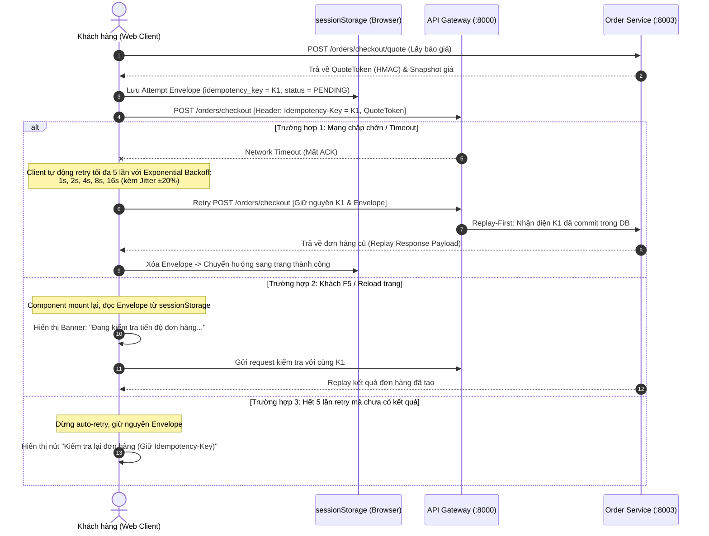
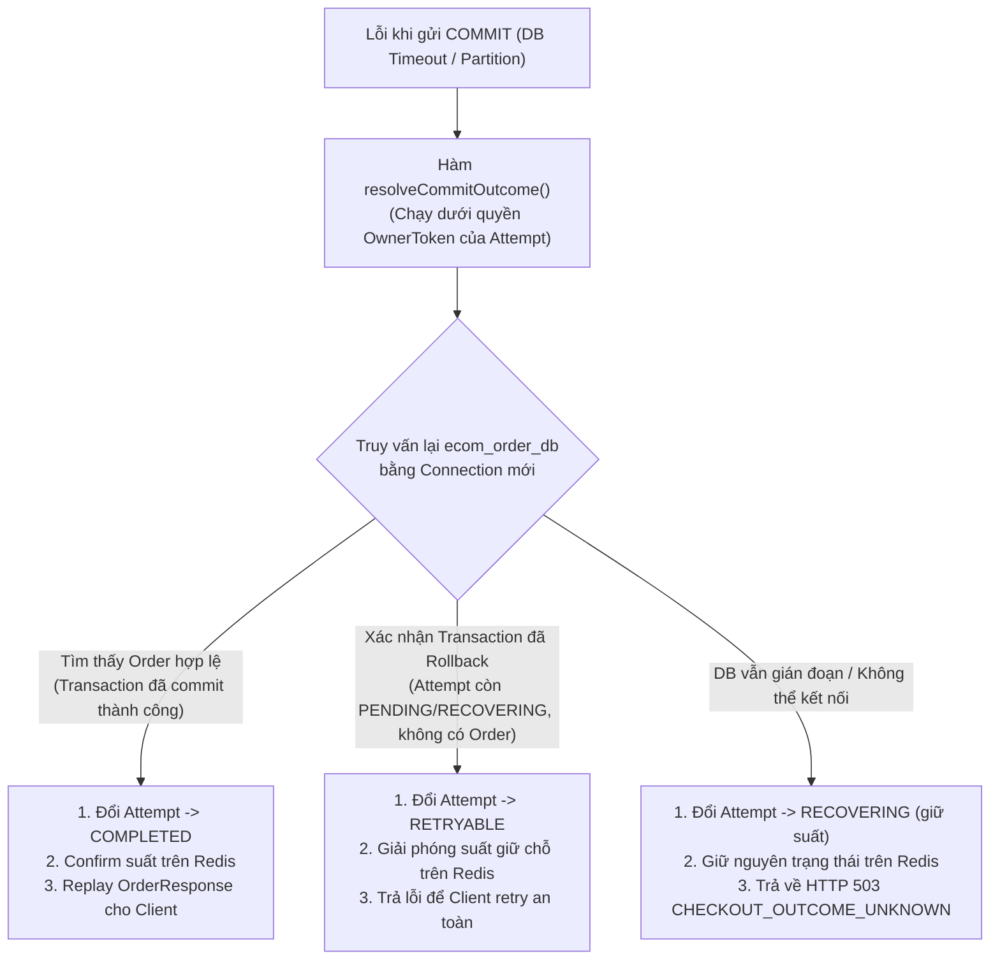
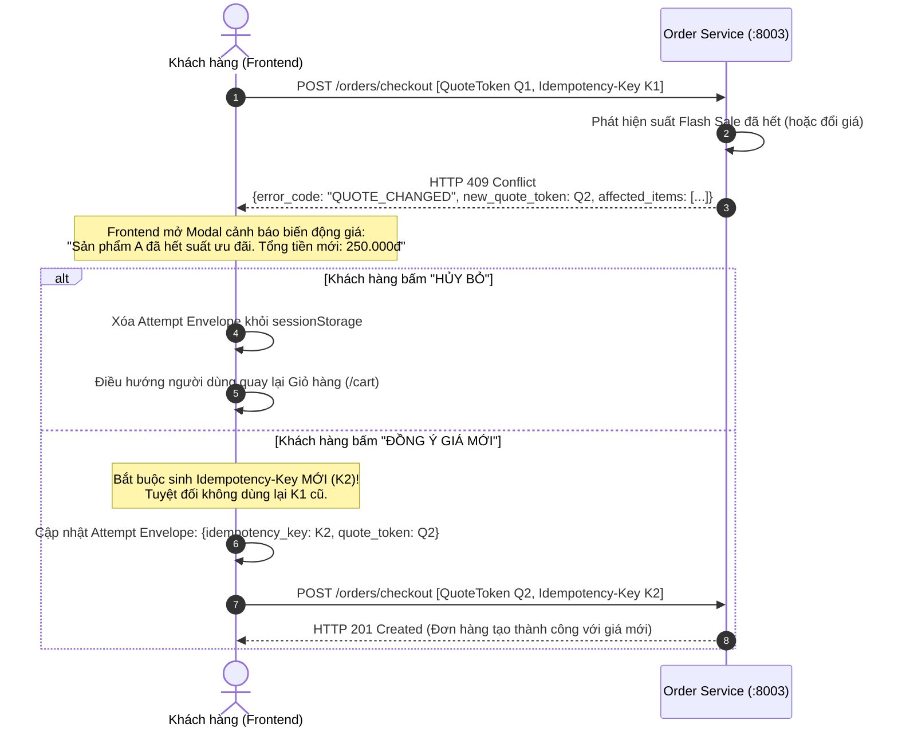
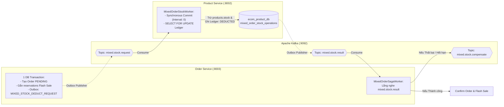

# ⚡ KIẾN TRÚC FLASH SALE UNIFIED CHECKOUT TOÀN DIỆN (PRODUCTION-GRADE REVISION 2)
### High-Concurrency Distributed Flash Sale & Unified Checkout Engine (Golang, Redis Cluster, Apache Kafka, PostgreSQL)

---

## 1. Tổng Quan: Sự Chuyển Dịch Sang Kiến Trúc Unified Checkout

Trước đây, hệ thống thương mại điện tử từng áp dụng mô hình phân mảnh 2 luồng: *Hot-Path Mua ngay riêng biệt* và *Giỏ hàng hỗn hợp riêng biệt*. Mô hình cũ bộc lộ nhiều điểm yếu chí tử khi đưa vào môi trường production: phân mảnh trải nghiệm khách hàng, rủi ro rò rỉ quota (quota leak), ghost reservation khi worker gặp sự cố mạng, và xung đột tồn kho.

Hệ thống đã nâng cấp toàn diện lên **Kiến Trúc Checkout Đơn Nhất (Unified Checkout Architecture - Revision 2)** đạt chuẩn kỹ thuật của các sàn TMĐT quy mô lớn (Shopee, Tiki, Amazon):

```
                                  ┌─────────────────────────────────────────────────────────────┐
                                  │           HỆ THỐNG UNIFIED CHECKOUT E-COMMERCE              │
                                  │    (Hợp nhất 100% Hàng thường & Flash Sale vào 1 Luồng)     │
                                  └──────────────┬───────────────────────────────┬──────────────┘
                                                 │                               │
                      ┌──────────────────────────┴──────────┐ ┌──────────────────┴──────────────────────────┐
                      │  CHẾ ĐỘ 1: DIRECT "MUA NGAY"        │ │  CHẾ ĐỘ 2: CART CHECKOUT                    │
                      │  (Mua ngay 1 chạm từ Deal / Banner) │ │  (Thanh toán nhiều món từ giỏ hàng)         │
                      ├─────────────────────────────────────┤ ├─────────────────────────────────────────────┤
                      │ • Canonical API: POST /orders/checkout                                              │
                      │ • Báo giá chuẩn hóa trước bằng Quote Token (HMAC-SHA256, TTL 10m)                   │
                      │ • Canonical Request Fingerprinting (SHA-256 Hex) chống tampering                    │
                      │ • Transaction Fencing 5 bước nguyên tử + CAS State Machine (Version uint64)         │
                      │ • Chặn Late-Reserve tuyệt đối bằng Redis Marker CLOSED                              │
                      │ • Replay-First Idempotency (Replay kết quả cũ bất chấp Quote Token expired)         │
                      │ • Dọn giỏ hàng theo Snapshot Delta (Bảo toàn món thêm mới khi checkout in-flight)   │
                      │ • Saga Choreography 2 chiều với Product Service qua Operation Ledger                │
                      │ • Phương thức thanh toán: COD-Only (khi đơn chứa Flash Sale), COD/VNPAY/MOMO thường │
                      └─────────────────────────────────────────────────────────────────────────────────────┘
```

### So sánh Kiến trúc Cũ vs. Kiến trúc Unified Checkout (Revision 2)

| Đặc điểm kỹ thuật | Mô hình Cũ (Deprecated) | Unified Checkout Revision 2 (Hiện tại) |
| :--- | :--- | :--- |
| **Endpoint Ingress** | Bị phân mảnh: `/orders/flash-sale`, `/flash-sales/.../orders`, `/orders/` | **Một Endpoint duy nhất**: `POST /orders/checkout` (chuẩn hóa `FromCart: true/false`) |
| **Quản lý phiên đặt hàng** | Polling token rải rác trên RAM Redis (`FSO-...`) | **Frontend Attempt Envelope** lưu `sessionStorage`, exponential backoff + jitter $\pm 20\%$ |
| **Bảo vệ tính toàn vẹn** | Check idempotency sơ sài qua middleware | **Canonical SHA-256 Fingerprint**: Sort item ID, gộp dòng trùng, hash các trường nhận hàng |
| **Chống Stale Worker** | Không có fencing, worker chậm có thể ghi đè đơn | **Transaction Fencing 5 bước**: Check Version CAS trong DB Transaction trước khi commit |
| **Chống Request đến muộn** | TTL ngắn trên Redis, dễ bị rò rỉ quota | **Marker `CLOSED` trên Redis Lua**: 0 TTL, chặn vĩnh viễn late reserve đến sau cleanup |
| **Dọn giỏ hàng (Cart)** | Xóa toàn bộ giỏ hàng mù quáng bằng User ID | **Snapshot Delta Cleanup**: `cart.qty - order.qty`, giữ nguyên các món khách vừa thêm |
| **Phân giải lỗi Commit** | Dễ rò rỉ khi mạng đứt giữa chừng | **Commit Outcome Resolution**: Tra cứu DB trước khi nhả Redis, không bao giờ nhả nhầm |

---

## 2. Vòng Đời Phiên Checkout & Frontend Attempt Envelope (R3)

Để đối phó với hiện tượng mất kết nối mạng (Network Partition), người dùng F5 tải lại trang, hoặc adapter mất gói tin ACK (Lost ACK), Frontend duy trì một **Attempt Envelope** trong `sessionStorage` của trình duyệt:

```ts
interface CheckoutAttemptEnvelope {
  idempotency_key: string;       // Khóa duy nhất (UUID v4) của phiên đặt hàng
  fingerprint: string;           // Hash SHA-256 của giỏ hàng tại thời điểm checkout
  payload: CreateOrderPayload;   // Thông tin khách hàng & danh sách sản phẩm snapshot
  quote_token: string;           // Báo giá đã ký số HMAC từ server
  created_at: number;            // Timestamp bắt đầu checkout
  status: "PENDING" | "RETRYING" | "COMPLETED" | "FAILED";
}
```



---

## 3. Canonical Request Fingerprint & Replay-First Idempotency (R5)

### 3.1. Băm Chuẩn Hóa Canonical Fingerprint (SHA-256)
Ngăn chặn triệt để hành vi vô tình hay cố ý gửi cùng một `Idempotency-Key` nhưng sửa đổi nội dung đơn hàng (tampering). Thuật toán chuẩn hóa bao gồm:
1. **Trim space & lowercase**: Chuẩn hóa họ tên, email lowercase, địa chỉ, phương thức thanh toán.
2. **Basket Normalization (P0)**:
   - Sắp xếp danh sách sản phẩm theo `product_id ASC`.
   - Gộp các dòng có cùng `product_id` thành 1 dòng duy nhất với tổng số lượng (`normalizeAndMergeItems`).
3. **Canonical Hashing**: Băm SHA-256 trên chuỗi JSON cấu trúc định danh chuẩn:
   ```go
   hash = SHA256(UserID + "|" + CustomerEmail + "|" + CustomerPhone + "|" + ShippingAddress + "|" + PaymentMethod + "|" + QuoteToken + "|" + FromCart + "|" + SortedItemsJSON)
   ```

### 3.2. Cơ Chế Replay-First (Zero Quote Expiration Check)
Khi một request gửi lên mang `Idempotency-Key` đã tồn tại trong bảng `checkout_attempts`:
1. **So khớp Fingerprint**:
   - Nếu Fingerprint khác nhau $\rightarrow$ Trả ngay `HTTP 409 IDEMPOTENCY_CONFLICT` (ngăn cản việc dùng lại key cũ cho đơn hàng mới).
   - Nếu Fingerprint trùng khớp và trạng thái là `COMPLETED`:
2. **Replay Trực Tiếp**: Trả về `ResponsePayload` đã lưu trong `checkout_attempts` mà **tuyệt đối không kiểm tra hạn của QuoteToken** và **không gọi giữ chỗ lại trên Redis**. Đảm bảo đơn hàng đã thành công trong quá khứ không bao giờ bị từ chối oan do đồng hồ trôi qua hạn báo giá.

---

## 4. Fencing Token Transaction 5 Bước Nguyên Tử & CAS State Machine (R1)

Để bảo vệ hệ thống trước tình huống **Slow Worker / Network Delay**: Worker 1 bị lag/treo, lease hết hạn; Worker 2 tiến hành takeover và commit thành công; sau đó Worker 1 hồi tỉnh và cố gắng ghi đè kết quả. Hệ thống áp dụng **Fencing Token** kết hợp **CAS (Compare-And-Swap)**:

```
[PENDING] ──(Timeout Lease)──> [RECOVERING] ──(CAS Win: Version++)──> [RETRYABLE]
    │                                                                       │
    │ (Transaction Commit Thành Công)                                        │ (Retry cùng key)
    ▼                                                                       ▼
[COMPLETED]                                                           [PENDING]
```

### 5 Bước Nguyên Tử Trong 1 Database Transaction (`ecom_order_db`):
1. **SHARE Lock Campaign**:
   ```sql
   SELECT * FROM flash_sale_campaigns WHERE id IN (...) FOR SHARE;
   ```
   Kiểm tra chiến dịch còn `ACTIVE`. Hàng ngàn checkout đồng thời có thể cùng lấy SHARE lock mà không gây nghẽn (không block lẫn nhau).
2. **Bảo Vệ Hạn Mức Phân Bổ (Conditional Update)**:
   ```sql
   UPDATE flash_sale_items
   SET reserved_stock = reserved_stock + :qty
   WHERE id = :item_id AND campaign_id = :campaign_id
     AND reserved_stock + sold_stock + :qty <= allocated_stock;
   ```
   Nếu `RowsAffected == 0` $\rightarrow$ Rollback ngay lập tức (Lỗi `ALLOCATION_EXCEEDED`).
3. **Chèn Outbox Event (Transactional Outbox Pattern)**:
   Ghi bản ghi `MIXED_STOCK_DEDUCT_REQUEST` vào bảng `outbox_events` để Saga Worker phát sang Kafka.
4. **Tạo Đơn Hàng (`orders`)**:
   Gắn `CheckoutAttemptID = attempt.ID` và chèn chi tiết `order_items`.
5. **Đóng Attempt Fencing (CAS Fencing Token Check)**:
   ```sql
   UPDATE checkout_attempts
   SET status = 'COMPLETED', order_id = :order_id, order_code = :order_code,
       response_payload = :payload, version = version + 1
   WHERE id = :attempt_id AND version = :expected_version;
   ```
   Nếu `RowsAffected == 0`: Worker nhận diện đã bị thu hồi quyền (Fenced Out), transaction lập tức ROLLBACK. Worker chậm bị chặn đứng hoàn toàn, không thể ghi đè kết quả của Winner Worker!

---

## 5. Marker `CLOSED` & Phòng Chống Late Reserve (R2)

### Vấn Đề
Worker A gửi lệnh giữ chỗ lên Redis, nhưng gói tin mạng bị kẹt trên đường truyền. Worker B tiến hành Crash Recovery, dọn dẹp reservation và đưa attempt sang trạng thái kết thúc. 120 giây sau, gói tin của Worker A mới tới Redis. Nếu Redis chỉ kiểm tra tồn kho đơn thuần, nó sẽ cấp một suất giữ chỗ "ma" (Ghost Reservation), dẫn tới rò rỉ quota và âm kho!

### Giải Pháp Kỹ Thuật
1. Khi một attempt bị hủy hoặc recovery xong, hệ thống ghi một Marker `CLOSED` vào Redis Hash/Key của attempt đó với **TTL = 0 (Vĩnh viễn theo vòng đời chiến dịch)**:
   ```redis
   SET fs:closed_attempts:<attempt_id> "CLOSED"
   ```
2. **Atomic Lua Script (`ReserveFlashSaleStock`)**:
   Trước khi trừ kho hay tăng quota, script bắt buộc kiểm tra:
   ```lua
   if redis.call('EXISTS', closed_key) == 1 then
       return -3 -- Marker CLOSED: Từ chối tuyệt đối late reserve
   end
   ```
   Nhờ đó, gói tin trễ 120 giây bị triệt tiêu ngay lập tức tại RAM Redis, không sinh ra bất kỳ thay đổi nào trong hệ thống.

---

## 6. Phân Giải Commit Outcome (Outcome Resolution & DB Recovery) (R4)

Khi thực thi transaction tạo đơn hàng trong PostgreSQL, nếu xảy ra lỗi timeout mạng hoặc mất kết nối DB đúng vào thời điểm gửi lệnh `COMMIT`:
- Order Service **không thể biết chắc chắn** transaction trên DB đã được commit thành công hay đã bị rollback.
- **Quy tắc tuyệt đối**: Không được vội vàng giải phóng suất giữ chỗ trên Redis! Việc release sớm khi DB đã thực sự commit sẽ làm người khác vào mua mất suất, dẫn tới bán âm kho (Overselling).



---

## 7. Giao Thức Xung Đột Báo Giá: Q1 $\rightarrow$ Q2 Flow (HTTP 409 `QUOTE_CHANGED`)

Khi khách hàng bấm đặt hàng, nếu giữa thời điểm lấy báo giá (`/orders/checkout/quote`) và thời điểm đặt hàng (`/orders/checkout`), chiến dịch Flash Sale bị hết suất hoặc quản trị viên đổi giá:



---

## 8. Dọn Giỏ Hàng Theo Snapshot Delta (Cart Snapshot Delta Cleanup)

### Vấn Đề
Khách có 2 sản phẩm A trong giỏ. Khách mở trang checkout (snapshot A x 2). Trong lúc đang điền địa chỉ, khách mở tab mới thêm 1 sản phẩm A vào giỏ (tổng trong giỏ thành 3 sản phẩm A). Nếu hệ thống xóa sạch sản phẩm A khi đơn hàng checkout thành công, khách sẽ bị mất oan 1 sản phẩm A vừa thêm mới!

### Giải Pháp Kỹ Thuật
Khi đơn hàng hoàn tất, hệ thống thực hiện dọn giỏ hàng theo công thức **Quantity Delta Snapshot**:
```go
latestCart, _ := s.cartRepo.GetCartByUserID(userID)
for _, orderItem := range orderItems {
    for _, cartItem := range latestCart.Items {
        if cartItem.ProductID == orderItem.ProductID {
            remainingQty := cartItem.Quantity - orderItem.Quantity
            if remainingQty <= 0 {
                _ = s.cartRepo.RemoveItem(latestCart.ID, cartItem.ID)
            } else {
                _ = s.cartRepo.UpdateItemQuantity(latestCart.ID, cartItem.ID, remainingQty)
            }
            break
        }
    }
}
```
- Trong ví dụ trên: `remainingQty = 3 - 2 = 1`. Giỏ hàng còn lại đúng 1 sản phẩm A.
- Nếu đơn hàng là **Direct "Mua ngay"** (`FromCart == false`), hệ thống **không can thiệp vào giỏ hàng**, bảo toàn 100% giỏ hàng hiện tại của khách.

---

## 9. Saga Trừ Kho Thường & Bồi Hoàn 2 Chiều (Product Service Ledger)

Đối với các đơn hàng hỗn hợp (chứa cả sản phẩm Flash Sale lẫn hàng thường):



### Operation Ledger Chống Trừ Kho Hai Lần & Bồi Hoàn Trễ
Bảng `mixed_order_stock_operations` tại `ecom_product_db` lưu vết trạng thái của từng `order_id`:
- **`DEDUCTED`**: Đã trừ kho thường thành công. Nếu Kafka gửi lại message, worker kiểm tra thấy `DEDUCTED` sẽ trả ngay kết quả thành công mà không trừ kho lần 2.
- **`COMPENSATED`**: Đã hoàn kho.
- **Xử lý Late Success**: Nếu reservation Flash Sale bị hết hạn trước khiến đơn bị hủy, nhưng thông báo trừ kho thường thành công tới muộn: `MixedOrderSagaWorker` phát hiện đơn đã `CANCELLED`, lập tức kích hoạt sự kiện bồi hoàn `mixed.stock.compensate`, trả lại tồn kho thường về nguyên vẹn.

---

## 10. Hàng Rào Bảo Vệ Tồn Kho: Drain Barrier & Settlement Barrier (`EndCampaign`)

Khi một chiến dịch Flash Sale kết thúc (do hết giờ hoặc Admin chủ động bấm kết thúc), hệ thống kích hoạt **Hàng Rào 2 Tầng**:

1. **Drain Barrier (Xả Cạn Suất Giữ Chỗ)**:
   - Quét toàn bộ mặt hàng trong chiến dịch: Nếu còn `reserved_stock > 0`, **từ chối kết thúc chiến dịch ngay lập tức**.
   - Bảo vệ tuyệt đối các khách hàng đang trong tiến trình checkout (Saga đang chạy dở). Không bao giờ thu hồi kho khi giao dịch phân tán chưa ngã ngũ.
2. **Settlement Barrier (Đối Soát Sổ Cái 2 Database)**:
   - So sánh số lượng bán giữa 2 database độc lập:
     $$\text{ProductDB.sold\_quantity} == \text{OrderDB.sold\_stock}$$
   - Nếu `ProductDB < OrderDB`: Consumer Kafka đang bị chậm (Lag), hệ thống tự động retry chờ consumer đồng bộ xong.
   - Nếu `ProductDB > OrderDB`: Cảnh báo bất thường dữ liệu (Ledger Discrepancy), giữ nguyên trạng thái `ENDING` để kỹ sư kiểm tra.
3. **Thu Hồi Kho An Toàn (`ReleaseStock`)**:
   Khi cả 2 barrier đều vượt qua:
   $$\text{to\_release} = \text{allocated\_quantity} - \text{sold\_quantity} - \text{released\_quantity}$$
   Order Service gọi sang Product Service, thực hiện `SELECT ... FOR UPDATE` trên `product_stock_allocations`, cộng trả lại vào `products.stock` và chuyển chiến dịch sang `ENDED`.

---

## 11. Danh Mục API Hệ Thống Chuẩn Hóa

### 11.1. Customer Checkout APIs
| Method | Endpoint | Quyền hạn | Mô tả chức năng |
| :--- | :--- | :--- | :--- |
| `POST` | `/orders/checkout/quote` | Customer | Lấy báo giá snapshot cho giỏ hàng, ký số sinh `QuoteToken` HMAC (TTL 10m) |
| `POST` | `/orders/checkout` | Customer | **Canonical Checkout**: Đặt hàng đơn nhất (FromCart: true/false, `QuoteToken`, `Idempotency-Key`) |
| `POST` | `/orders/direct` | Customer | Alias của checkout trực tiếp (Direct mode) |
| `GET` | `/orders/:id` | Customer | Chi tiết đơn hàng và tiến trình xử lý |
| `GET` | `/orders` | Customer | Danh sách lịch sử đơn hàng của người dùng |

### 11.2. Admin Flash Sale APIs
| Method | Endpoint | Quyền hạn | Mô tả chức năng |
| :--- | :--- | :--- | :--- |
| `POST` | `/admin/flash-sales` | Admin | Tạo chiến dịch Flash Sale mới |
| `GET` | `/admin/flash-sales` | Admin | Danh sách chiến dịch (phân trang, lọc theo status) |
| `GET` | `/admin/flash-sales/:campaignId` | Admin | Chi tiết chiến dịch & danh sách sản phẩm phân bổ |
| `POST` | `/admin/flash-sales/:campaignId/items` | Admin | Thêm sản phẩm, giá ưu đãi, kho phân bổ, quota `max_per_user` |
| `POST` | `/admin/flash-sales/:campaignId/activate` | Admin | Kích hoạt Saga phân bổ kho & Prewarm Redis |
| `POST` | `/admin/flash-sales/:campaignId/clone` | Admin | Nhân bản cấu hình chiến dịch sang đợt mới |
| `POST` | `/admin/flash-sales/:campaignId/end` | Admin | Kết thúc chiến dịch qua **Drain Barrier & Settlement Barrier** |
| `POST` | `/orders/flash-sale/prewarm` | Admin | Nạp trước tồn kho Flash Sale lên RAM Redis |

---

## 12. Bảng 15 Ca Kiểm Thử Nghiệm Thu (T01 – T15) Đã Pass `-race -count=20`

File kiểm thử nghiệm thu: [`order_acceptance_race_test.go`](file:///home/nhat/Workspace/microserice-ecomerce/backend/services/order-service/internal/service/order_acceptance_race_test.go)

| Test ID | Tên Kịch Bản Kiểm Thử | Tình Huống Giả Lập & Assertion | Trạng Thái |
| :---: | :--- | :--- | :---: |
| **T01** | `ConcurrentIdenticalRequests` | 5 goroutines cùng gửi request với cùng user, Idempotency-Key và QuoteToken. Đúng 1 order được tạo trong DB, các request còn lại replay kết quả hoặc trả 409 ORDER_PROCESSING. | **PASS** |
| **T02** | `LeaseExpiry_CASRecovery_FenceSlowWorker` | Worker 1 giữ suất rồi pause; hết lease; Worker 2 recovery và commit (Version 2). Khi Worker 1 thức dậy commit bị FENCE chặn đứng (0 rows). Suất và quota của Worker 2 được bảo toàn. | **PASS** |
| **T03** | `ConcurrentTakeovers_CASWinning` | 2 recovery workers đồng thời takeover một attempt tại Version 1. Nhờ atomic CAS trong DB, chỉ đúng 1 worker giành quyền xử lý. | **PASS** |
| **T04** | `TransientError_Cleanup_RetrySameKey` | Lỗi tạm thời trước khi commit order; cleanup xong; retry với cùng Idempotency-Key. Tái sử dụng row attempt với generation mới, tạo đơn thành công, không duplicate key loop. | **PASS** |
| **T05** | `CrashRecovery_LateReserve_MarkerClosed` | Crash recovery hoàn tất và đánh dấu `CLOSED`. Request reserve trễ 120s bị Lua script từ chối bởi marker `CLOSED`. Không rò rỉ quota hay tạo ghost reservation. | **PASS** |
| **T06** | `AdapterLostAck_ReplayReturnsCommittedOrder` | DB commit thành công nhưng adapter trả lỗi mô phỏng mất ACK. Request retry cùng key lập tức replay lại Order đã commit trong DB, không release suất và không duplicate order. | **PASS** |
| **T07** | `CommitOutcomeUnknown_DBRecovery` | Commit DB bị unknown status; hệ thống không tự ý release Redis. Khi DB phục hồi: nếu commit thì replay order; nếu rollback thì cleanup và cho phép retry an toàn. | **PASS** |
| **T08** | `QuoteExpired_ClockAdvance_RedisDown_ReplayOrder` | Tạo order thành công; tiến đồng hồ vượt hạn QuoteToken và tắt Redis. Client retry token đã expired: hệ thống Replay-First trả ngay đơn cũ mà không từ chối Quote Expired. | **PASS** |
| **T09** | `CanonicalFingerprint_PayloadMutations` | Băm chuẩn hóa canonical SHA-256: thay đổi họ tên, địa chỉ, SĐT, payment bị trả 409 Conflict. Đổi thứ tự món hàng hoặc gộp dòng tương đương có cùng fingerprint và được chấp nhận. | **PASS** |
| **T10** | `FromCartQuote_And_CartChangesAfterCommit` | Sửa giỏ hàng trước checkout yêu cầu quote mới; sửa giỏ hàng sau khi đơn đã commit replay đơn cũ, không mua thêm hoặc xóa món mới thêm. | **PASS** |
| **T11** | `FE_Envelope_Lifecycle_And_Polling` | Vòng đời Frontend Attempt Envelope: lưu `sessionStorage`, retry tối đa 5 lần với exponential backoff kèm jitter. Quá 5 lần dừng loading và giữ Idempotency-Key để kiểm tra lại. | **PASS** |
| **T12** | `FE_Q1Rejected_Q2Approved_NewKeyFlow` | Khi gặp 409 QUOTE_CHANGED: nếu khách từ chối Q2 thì đưa về giỏ hàng; nếu khách duyệt Q2 thì sinh Idempotency-Key mới và đặt đơn thành công. | **PASS** |
| **T13** | `HTTP_KeyValidation_And_UserIsolation` | Key "idemp-shared" của User 1 không thể bị User 2 xem hoặc replay (User 2 tạo đơn mới độc lập). Header và body không khớp bị trả 400 Bad Request. | **PASS** |
| **T14** | `Regression_Regular_Sale_Mixed_Atomicity` | Đơn hàng hỗn hợp: Outbox Event ghi nguyên tử; Redis Flash Sale fail-closed; không trừ nhầm tồn kho thường cho sản phẩm Flash Sale. | **PASS** |
| **T15** | `Regression_CampaignEndRace_And_CartSnapshotDelta` | Checkout snapshot A x 2. Trong lúc request in-flight, khách thêm A x 1 (tổng trong giỏ thành 3). Sau khi đơn A x 2 tạo thành công, giỏ hàng còn lại đúng 1 món A (3 - 2 = 1). | **PASS** |
