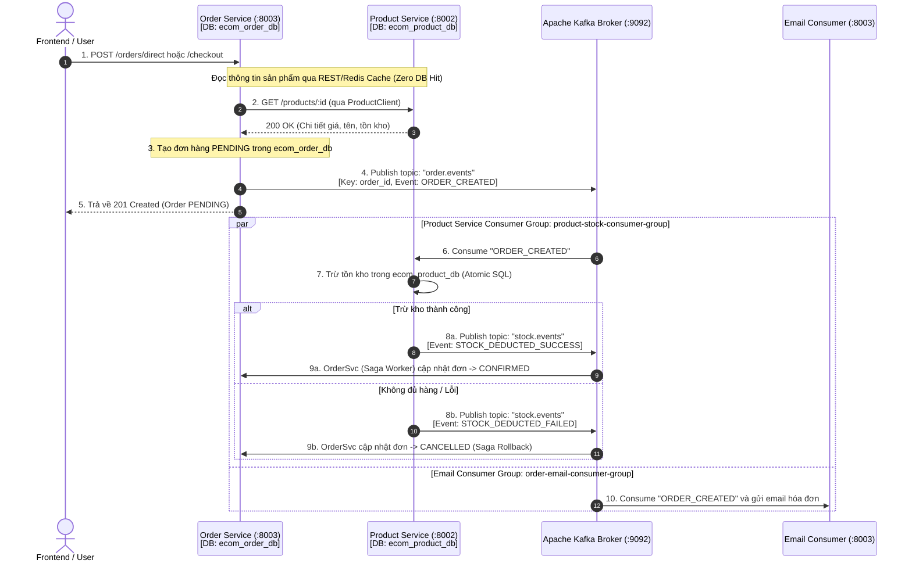

# Báo Cáo Kiến Trúc & Di Chuyển Hệ Thống: 100% Apache Kafka Event-Driven & Database-per-Service (Saga Choreography)

## 1. Bối cảnh & Vấn đề Cần Giải Quyết

Trước khi thực hiện cải tiến, hệ thống tồn tại 2 vấn đề kiến trúc nghiêm trọng:
1. **Shared Database Anti-Pattern**: 
   - `order-service` kết nối trực tiếp vào `ecom_product_db` (Database riêng của `product-service`) và sử dụng `productRepo` để đọc giá, tên sản phẩm và trực tiếp trừ/hoàn tồn kho trong PostgreSQL.
   - Điều này phá vỡ tính độc lập của Microservices, tạo sự phụ thuộc chặt chẽ giữa 2 service.
2. **Nhồi nhét công nghệ (Vừa RabbitMQ vừa Kafka)**:
   - Hệ thống vừa chạy RabbitMQ cho Order/Email, vừa chạy Kafka cho Product Views.
   - Khi đưa vào CV hoặc phỏng vấn, việc dùng cả 2 giải pháp cho hệ thống vừa/nhỏ dễ bị đánh giá là "thiếu định hướng kiến trúc, nhồi nhét buzzwords".
3. **Mục tiêu**:
   - Chuẩn hóa toàn bộ Message & Event Streaming Backbone sang **100% Apache Kafka**.
   - Tách biệt tuyệt đối **Database-per-Service**: `order-service` chỉ kết nối `ecom_order_db`, `product-service` chỉ kết nối `ecom_product_db`.
   - Áp dụng mô hình **Saga Choreography** qua các Kafka Topics để quản trị giao dịch phân tán (Distributed Transactions).

---

## 2. Kiến trúc Mới Tổng Thể (100% Apache Kafka & Saga Choreography)



---

## 3. Chi Tiết Các Thay Đổi Đã Thực Hiện

### 3.1. Thiết Kế Trục Message Backbone Kafka (`backend/pkg/kafka`)
- **[topics.go](file:///home/nhat/Workspace/microserice-ecomerce/backend/pkg/kafka/topics.go)**: Định nghĩa tập trung các Topics và Consumer Groups:
  - `order.events`: Phát các sự kiện đơn hàng (`ORDER_CREATED`, `ORDER_PAID`, `ORDER_CANCELLED`).
  - `stock.events`: Nhận kết quả trừ tồn kho từ Product Service (`STOCK_DEDUCTED_SUCCESS`, `STOCK_DEDUCTED_FAILED`).
  - `flashsale.orders`: Hàng đợi cắt đỉnh tải tác vụ mua Flash Sale.
  - `orders.dead_letter`: Dead Letter Topic (DLT) theo chuẩn Uber/Confluent để cô lập các bản tin lỗi.
- **[events.go](file:///home/nhat/Workspace/microserice-ecomerce/backend/pkg/kafka/events.go)**: Định nghĩa cấu trúc `OrderCreatedPayload`, `StockResultPayload`, `FlashSaleOrderTaskPayload`, `DeadLetterPayload`.
- **[order_producer.go](file:///home/nhat/Workspace/microserice-ecomerce/backend/pkg/kafka/order_producer.go)**: Cung cấp `OrderKafkaProducer` với các method publish đồng bộ, hỗ trợ hash key partition theo `order_id` để đảm bảo thứ tự xử lý.

### 3.2. Cắt Đứt Hoàn Toàn Shared Database (`backend/internal/client/product_client.go`)
- Tạo `ProductClient` đóng gói giao tiếp giữa `order-service` và `product-service`:
  1. Kiểm tra nhanh trên **Redis Cache** `cache:product:{id}` (< 1ms).
  2. Nếu cache miss, gọi HTTP REST sang `http://localhost:8002/products/{id}` với timeout 3s.
  3. Tự động nạp lại vào Redis Cache (TTL 15 phút).
- Loại bỏ toàn bộ kết nối `productDb` và `productRepo` khỏi `order-service` và `cart-service`.

### 3.3. Xây Dựng Các Saga Workers (`backend/internal/worker`)
1. **`ProductStockWorker`** (`product-service`):
   - Thuộc Consumer Group `product-stock-consumer-group`.
   - Lắng nghe topic `order.events`. Khi nhận `ORDER_CREATED`:
     - Trừ tồn kho atomic trong `ecom_product_db`.
     - Xóa cache chi tiết trên Redis.
     - Bắn kết quả `STOCK_DEDUCTED_SUCCESS` sang topic `stock.events`.
     - Nếu lỗi: Rollback các món đã trừ và bắn `STOCK_DEDUCTED_FAILED`.
2. **`OrderSagaWorker`** (`order-service`):
   - Thuộc Consumer Group `order-saga-consumer-group`.
   - Lắng nghe topic `stock.events`:
     - Nếu `success=true` $\rightarrow$ Chuyển trạng thái đơn sang `CONFIRMED`.
     - Nếu `success=false` $\rightarrow$ Chuyển trạng thái đơn sang `CANCELLED` và hoàn tồn kho Redis RAM.
3. **`OrderEmailWorker`** (`order-service`):
   - Chuyển từ RabbitMQ sang Kafka Consumer Group `order-email-consumer-group`.
   - Tự động gửi email xác nhận đặt hàng không chặn API.
4. **`FlashSaleWorker`** (`order-service`):
   - Lắng nghe topic `flashsale.orders` $\rightarrow$ Ghi đơn vào `ecom_order_db` $\rightarrow$ Bắn `order.events` vào Kafka để kích hoạt chuỗi Saga tiếp theo.

### 3.4. Cập Nhật Điểm Khởi Chạy Main Services
- **`cmd/order-service/main.go`**:
  - Loại bỏ hoàn toàn kết nối `productDb`.
  - Chỉ kết nối duy nhất vào `ecom_order_db`.
  - Khởi chạy song song 3 Kafka workers: `OrderEmailWorker`, `FlashSaleWorker`, `OrderSagaWorker`.
- **`cmd/product-service/main.go`**:
  - Tích hợp `orderKafkaProducer` và khởi chạy `ProductStockWorker` phục vụ luồng Saga.
- **`start_all.sh`**:
  - Loại bỏ RabbitMQ container khỏi lệnh khởi động. Chỉ chạy `postgres redis kafka`.

---

## 4. Kết Quả Kiểm Thử (Verification & Proof)

Hệ thống đã được kiểm thử thực tế và đạt kết quả 100%:

### 4.1. Luồng Đặt Hàng Thông Thường (E2E Order Checkout)
Chạy script kiểm thử `./test_e2e_order.sh`:
- **Bước 1:** Đăng ký tài khoản $\rightarrow$ Lấy OTP từ Redis $\rightarrow$ Verify email lấy JWT Token thành công.
- **Bước 2:** Gọi `POST /orders/checkout` (Đơn hàng #7: `ORD-2A8796BD`).
- **Bước 3:** Quan sát log Saga thời gian thực:
  ```
  [order-service]   📢 [KAFKA] Đã publish event order.created thành công order_id=7 order_code=ORD-2A8796BD
  [product-service] 📦 [SAGA CHOREOGRAPHY] Bắt đầu trừ tồn kho cho đơn hàng order_id=7 items_count=1
  [product-service] ✅ [SAGA] Trừ tồn kho Database thành công cho toàn bộ sản phẩm order_id=7
  [product-service] 📦 [KAFKA] Đã publish StockResult sang topic stock.events order_id=7 success=true
  [order-service]   🎉 [SAGA COMPLETED] Đơn hàng đã được xác nhận thành công! order_id=7 new_status=CONFIRMED
  [order-service]   ✅ Đã gửi email xác nhận đơn hàng thành công qua Kafka order_id=7
  ```
- **Bước 4:** Kiểm tra Database:
  - `ecom_order_db`: Đơn hàng #7 có trạng thái `CONFIRMED`.
  - `ecom_product_db`: Tồn kho sản phẩm #1 tự động giảm từ 50 xuống 48.

### 4.2. Luồng Đặt Hàng Flash Sale Chịu Tải Cao (Flash Sale Concurrency)
Chạy script kiểm thử `./test_flash_sale.sh`:
- Đơn hàng Flash Sale #8 (`ORD-FS-A310393D`) được tiếp nhận vào Kafka topic `flashsale.orders` trong 12ms (HTTP 202 Accepted).
- `FlashSaleWorker` đọc từ Kafka, ghi vào `ecom_order_db` $\rightarrow$ Bắn sang `order.events` $\rightarrow$ `ProductStockWorker` trừ kho `ecom_product_db` $\rightarrow$ `OrderSagaWorker` chuyển trạng thái sang `CONFIRMED`.
- Polling trạng thái trả về: `status: "SUCCESS"`.
- 14 request spam cùng lúc bị chặn đứng ở Redis RAM.

---

## 5. Giá Trị Đưa Vào CV / Phỏng Vấn

Với kiến trúc này, bạn có thể tự tin trình bày trong CV:
> *"Thiết kế và triển khai kiến trúc **Event-Driven Microservices** sử dụng **100% Apache Kafka** và nguyên tắc **Database-per-Service** (Go, PostgreSQL, Redis, Kafka KRaft):*
> *- Áp dụng mô hình **Saga Choreography** thông qua các Kafka Topics (`order.events`, `stock.events`) để đảm bảo tính nhất quán dữ liệu cuối cùng (Eventual Consistency) khi trừ kho và hoàn kho.*
> *- Xử lý Flash Sale chịu tải cao với Redis Atomic Lock kết hợp Kafka Worker cắt đỉnh tải ghi đĩa và cô lập đơn lỗi qua **Dead Letter Topic (DLT)**.*
> *- Hoàn toàn xóa bỏ phụ thuộc dữ liệu chéo (Shared Database), tối ưu hóa đọc dữ liệu thông qua Cache-Aside và Inter-Service REST Client."*
