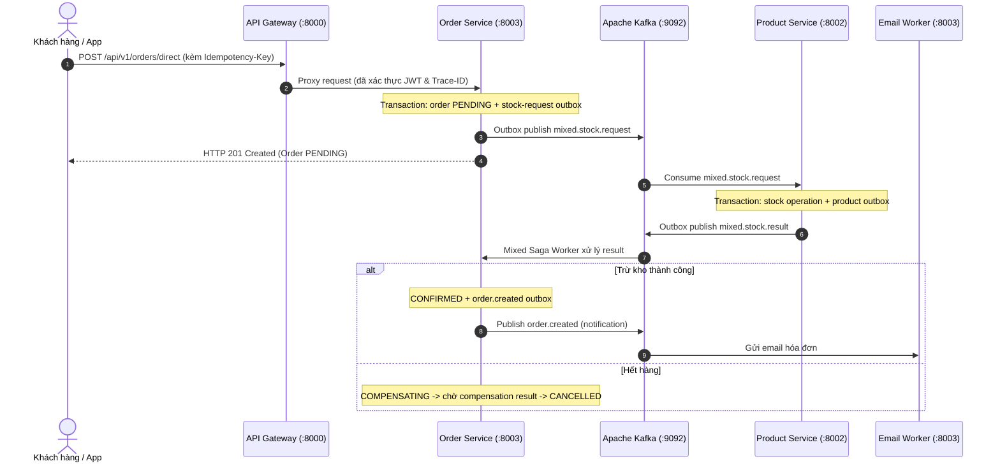

# 🛒 E-Commerce Microservices Backend

Hệ thống Backend Thương mại Điện tử hiệu năng cao xây dựng theo kiến trúc **Event-Driven Microservices**, áp dụng **Clean Architecture**, **Database-per-Service**, quản lý giao dịch phân tán bằng **Saga Choreography (100% Apache Kafka)** và kiểm soát tranh chấp bằng **Redis Distributed Lock**.

---

## 🏛 1. Kiến Trúc Tổng Thể (System Architecture)

Dự án được tổ chức theo mô hình **Multi-Module Monorepo** với [go.work](go.work), mỗi Microservice là một Go module độc lập có `go.mod` và `Dockerfile` riêng, chia sẻ module dùng chung [pkg/](pkg/).

```
backend/
├── go.work                          # Quản lý multi-module workspace (Go 1.26)
├── docker-compose.yml               # Hạ tầng: Postgres, Redis, Kafka, Elasticsearch
├── infra/
│   └── postgres/init-databases.sh   # Tự động khởi tạo 3 Database độc lập
├── pkg/                             # Module dùng chung (go.mod riêng: ecomerce-service/pkg)
│   ├── config/                      # Quản lý biến môi trường tập trung (.env)
│   ├── kafka/                       # Event & Topic constants, Producers, Consumers
│   ├── logger/                      # Structured JSON Logger + Trace ID propagation
│   ├── middlewares/                 # Auth JWT, Idempotency-Key, RequestID, CORS
│   ├── redislock/                   # Khóa phân tán Redis Lock (Lua Script nguyên tử)
│   ├── response/                    # Định dạng JSON Response chuẩn {success, code, data, error}
│   └── server/                      # Khởi tạo Web Server Fiber chuẩn hóa
└── services/                        # Các Microservice nghiệp vụ độc lập
    ├── api-gateway/                 # Cổng điều hướng, Auth check, Rate Limit (:8000)
    ├── user-service/                # Quản lý User, Auth JWT, gRPC Server (:8001, gRPC :50051)
    ├── product-service/             # Sản phẩm, Tồn kho, Flash Sale Atomic Lock (:8002)
    └── order-service/               # Đơn hàng, Giỏ hàng, Kafka Saga Worker (:8003)
```

---

## 🔌 2. Danh Sách Dịch Vụ & Cổng Kết Nối (Services & Ports)

### Microservices
| Service | HTTP Port | gRPC Port | Database | Nhiệm vụ chính |
| :--- | :---: | :---: | :--- | :--- |
| **API Gateway** | `8000` | - | - | Reverse Proxy, Rate Limiting, JWT Auth Middleware, Trace ID |
| **User Service** | `8001` | `50051` | `ecom_user_db` | Đăng ký, Đăng nhập JWT, Quản lý tài khoản, gRPC API |
| **Product Service** | `8002` | - | `ecom_product_db` | Quản lý sản phẩm, Trừ kho nguyên tử bằng Redis Lock, View counter |
| **Order Service** | `8003` | - | `ecom_order_db` | Giỏ hàng, Đặt hàng, Điều phối Saga Choreography, Email Worker |

### Hạ Tầng (Docker Infrastructure)
| Container | Port | Mô tả |
| :--- | :---: | :--- |
| **PostgreSQL** | `5428` | Cơ sở dữ liệu chính (Tách biệt 3 database riêng) |
| **Redis** | `6379` | Cache, Idempotency Key, Khóa phân tán Flash Sale, Pub/Sub |
| **Apache Kafka** | `9092` | Message & Event Streaming Backbone (KRaft mode) |
| **Elasticsearch** | `9200` | Lưu trữ log và tìm kiếm sản phẩm nâng cao |

---

## ⚡ 3. Luồng Giao Dịch Phân Tán (Saga Choreography)

Hệ thống tuân thủ nghiêm ngặt nguyên tắc **Database-per-Service** (Zero Shared Database). Quá trình đặt hàng và trừ kho được điều phối bất đồng bộ qua **Apache Kafka**:

Checkout hiện tại (đơn chỉ có hàng thường hoặc giỏ hỗn hợp) tạo order `PENDING` và `mixed.stock.request` trong **cùng Order DB transaction**. Product Service trừ kho thường và ghi `mixed.stock.result` vào Product DB outbox trong cùng transaction; Order Service xác nhận/hủy sau khi nhận result. `order.created` chỉ được phát sau khi xác nhận và **không** kích hoạt trừ kho lần hai. Hai consumer cũ dùng `order.created → stock.events` không còn được khởi chạy. Nếu nâng cấp từ một bản đã có order `PENDING` theo luồng cũ, cần xử lý/migrate backlog đó trước khi triển khai bản mới; không tự ý reset Kafka offset.



---

## 🛡 4. Cơ Chế Chống Race Condition & Idempotency (Unified Checkout Revision 2)

1. **Replay-First Idempotency & Canonical Fingerprint (SHA-256)**:
   - Tra cứu `checkout_attempts` và so khớp fingerprint trước khi kiểm tra hạn của `QuoteToken`.
   - Nếu đơn hàng đã hoàn tất (`COMPLETED`): Replay ngay kết quả cũ mà không bị chặn bởi quote token expired.
   - Băm SHA-256 chuẩn hóa giỏ hàng và thông tin giao hàng để phát hiện ngay hành vi cố tình sửa body nhưng gửi trùng Idempotency-Key.
2. **Transaction Fencing 5 Bước & CAS State Machine**:
   - Khóa `FOR SHARE` campaign $\rightarrow$ Kiểm tra quota $\rightarrow$ Ghi Outbox Saga $\rightarrow$ Tạo đơn $\rightarrow$ Chốt attempt với CAS Version check.
   - Ngăn chặn triệt để Stale Slow Worker ghi đè kết quả khi lease bị quá hạn.
3. **Marker `CLOSED` Trên Redis Lua Script**:
   - Đánh dấu `CLOSED` (0 TTL) trên Redis sau khi cleanup/recovery; Lua script từ chối tức thì các request trễ mạng sau 120s, triệt tiêu ghost reservation.
4. **Snapshot Delta Cart Cleanup**:
   - Dọn giỏ hàng theo quantity delta (`cart.qty - order.qty`), bảo toàn chính xác các sản phẩm mà khách hàng thêm mới trong lúc request checkout đang in-flight.

---

## 🚀 5. Hướng Dẫn Cài Đặt & Chạy Hệ Thống

### Yêu cầu tiên quyết:
- **Go**: Phiên bản `>= 1.26`
- **Docker & Docker Compose**

### Bước 1: Khởi động Hạ tầng Docker
```bash
docker compose up -d
```
> Script [infra/postgres/init-databases.sh](infra/postgres/init-databases.sh) sẽ tự động khởi tạo 3 databases: `ecom_user_db`, `ecom_product_db`, `ecom_order_db`.

### Bước 2: Chạy toàn bộ Microservices
```bash
# Khởi chạy tất cả 4 service dưới nền:
./start_all.sh run

# Kiểm tra trạng thái các service:
./start_all.sh status

# Xem log thời gian thực:
tail -f logs/order-service.log
```

### Bước 3: Dừng toàn bộ Microservices
```bash
./start_all.sh stop
```

---

## 🧪 6. Kiểm Thử Hệ Thống (Automated Testing)

### 1. Chạy toàn bộ 15 ca Nghiệm Thu (Acceptance Tests) với Race Detector (count=20):
```bash
make test-acceptance
# Hoặc chạy trực tiếp:
go test -tags=acceptance -race -count=20 ./services/order-service/internal/service -run="TestAcceptance_"
```

### 2. Chạy toàn bộ Unit Tests trong Workspace:
```bash
make test
# Hoặc:
go test ./services/api-gateway/... ./services/user-service/... ./services/product-service/... ./services/order-service/... ./pkg/...
```

### 3. Chạy E2E Test (Luồng Đăng ký -> Đăng nhập -> Xem sản phẩm -> Giỏ hàng -> Đặt hàng -> Idempotency Lock):
```bash
./test_e2e_order.sh
```

### 4. Chạy Flash Sale Test (Giả lập tranh chấp kho cao điểm):
```bash
./test_flash_sale.sh
```

---

## 📐 7. Chuẩn Thiết Kế Clean Architecture Trong Mỗi Service

Mỗi Microservice bên trong thư mục `services/` được chia theo 4 tầng khép kín:
- `internal/domain/`: Thực thể cốt lõi (Entities) và Interfaces trừu tượng. **Tuyệt đối không phụ thuộc vào framework ngoài**.
- `internal/service/`: Nghiệp vụ ứng dụng (Use Cases). Chỉ phụ thuộc vào Domain Interfaces.
- `internal/repository/`: Hiện thực lưu trữ (PostgreSQL / GORM).
- `internal/client/`: Gọi sang các microservice khác qua REST/gRPC (chống truy cập chéo DB).
- `internal/delivery/`: Tầng giao tiếp bên ngoài (`http/handlers` cho REST và `grpc/handlers` cho Protobuf RPC).
- `cmd/`: Điểm khởi chạy (Composition Root) thực hiện Dependency Injection.
