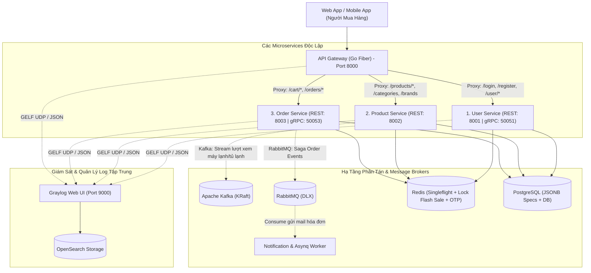
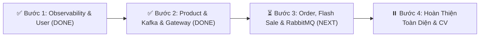

# 🚀 Kiến Trúc Enterprise Microservices & Lộ Trình Triển Khai: Sàn TMĐT Điện Máy

> **Tiêu chuẩn:** Enterprise Distributed Systems • High Concurrency • Event-Driven Architecture  
> **Tech Stack:** Golang 1.25 (Clean Architecture) • PostgreSQL • Redis • RabbitMQ • Apache Kafka • Graylog (OpenSearch + MongoDB) • gRPC/Protobuf • Go Fiber • Asynq • Docker

---

## 🏛️ PHẦN 1: BẢN THIẾT KẾ KIẾN TRÚC TOÀN DIỆN

Hệ thống được thiết kế theo mô hình **Monorepo Microservices độc lập**, gồm **API Gateway**, **3 Core Microservices**, và **Hệ thống giám sát Graylog**:



---

## 📊 PHẦN 2: BẢNG MA TRẬN CÔNG NGHỆ VÀ TRÁCH NHIỆM

| Service / Tool | Port | Trách nhiệm chính trong hệ thống | Kỹ thuật Enterprise áp dụng |
| :--- | :--- | :--- | :--- |
| **🌐 API Gateway** | `8000` | - Cửa ngõ duy nhất đón nhận request từ Client.<br>- Điều hướng Reverse Proxy sang các service con. | Rate Limiter (100 req/min), Global CORS, `X-Request-ID` Trace ID. |
| **👤 User Service** | `8001` (gRPC: `50051`) | - Đăng ký nhận OTP qua Email, kích hoạt tài khoản.<br>- Đăng nhập cấp JWT Token, xem Profile người mua hàng. | Asynq Worker, Redis OTP TTL 15m, gRPC Server. |
| **📦 Product Service** | `8002` | - Danh mục, thương hiệu, sản phẩm điện máy.<br>- Thông số kỹ thuật động (BTU, Inverter, dung tích...). | Cache-Aside (Redis), `singleflight` chống sập DB, Kafka Producer. |
| **🛒 Order Service** | `8003` (gRPC: `50053`) | - Giỏ hàng, Đặt hàng, Áp mã Voucher, Thanh toán.<br>- Điều phối trạng thái đơn hàng. | Redis Atomic `DECR` (Flash Sale), `Idempotency-Key`, RabbitMQ Saga. |
| **📊 Graylog** | `9000` (GELF: `12201`) | - Quản lý và tìm kiếm log tập trung toàn hệ thống. | Chuẩn GELF UDP, OpenSearch indexing, Trace ID search. |

---

## 📍 PHẦN 3: BẢNG THEO DÕI TIẾN ĐỘ THỰC TẾ (PROGRESS STATUS)



### ✅ BƯỚC 1: Observability (Graylog & Slog), Trace ID & User Service (ĐÃ HOÀN THÀNH 100%)
- [x] Cấu hình cụm **Graylog + OpenSearch + MongoDB** trong `docker-compose.yml`.
- [x] Xây dựng gói **Structured Logger** (`pkg/logger`) dùng `log/slog` gửi GELF UDP tới Graylog.
- [x] Viết Middleware **`X-Request-ID`** tự động gán Trace ID và đo `latency_ms`.
- [x] Viết Middleware **`RBAC`** kiểm tra phân quyền.
- [x] Tinh gọn luồng **Customer / Buyer** (Đăng ký OTP $\rightarrow$ Verify Email $\rightarrow$ Login $\rightarrow$ Profile).
- [x] Viết Unit Test và đạt 100% PASS.

---

### ✅ BƯỚC 2: Product & Catalog Service, Redis Cache & Kafka Stream (ĐÃ HOÀN THÀNH 100%)
- [x] Thiết kế Domain & DB Entity: `Category`, `Brand`, `Product` với cột `specifications (JSONB)`.
- [x] Tạo PostgreSQL Repository hỗ trợ lọc đa chiều (`min_price`, `max_price`, danh mục, thương hiệu, từ khóa `ILIKE`).
- [x] Tự động Seed dữ liệu mẫu thực tế về đồ điện máy (Daikin, Panasonic, Samsung, Bosch...).
- [x] Xây dựng cơ chế **Cache-Aside Redis** kết hợp **`singleflight`** chống sập database (Cache Stampede).
- [x] Tích hợp **Apache Kafka Producer** bắn event `ProductViewedEvent` ngầm.
- [x] Xây dựng **Kafka View Consumer Worker** (`internal/worker/product_view_worker.go`): Gom batch lượt xem định kỳ 5s cập nhật vào PostgreSQL và tự động xóa Cache Redis.
- [x] Cung cấp REST endpoints: `GET /categories`, `GET /brands`, `GET /products`, `GET /products/:id`.
- [x] Chuyển đổi thành công kiến trúc **Monorepo Microservices** với các binary độc lập:
  - `cmd/api-gateway/main.go` (Port 8000)
  - `cmd/user-service/main.go` (Port 8001 & gRPC 50051)
  - `cmd/product-service/main.go` (Port 8002)
- [x] Viết `Makefile` tự động hóa build/run và kiểm thử đạt 100% PASS.

---

### ⏳ BƯỚC 3: Order & Cart Service, Redis Flash Sale Lock & RabbitMQ (SẮP THỰC HIỆN LẦN TỚI)
- [ ] Thiết kế Domain & Entity: `Cart`, `CartItem`, `Order`, `OrderItem`.
- [ ] Viết API Giỏ hàng: `GET /cart`, `POST /cart/add`, `PUT /cart/update`, `DELETE /cart/remove`.
- [ ] Áp dụng **`Idempotency-Key` Middleware** chống bấm đặt hàng / thanh toán 2 lần.
- [ ] Xây dựng module **Flash Sale Atomic Lock với Redis (`DECR`)**: Chống bán âm kho khi hàng nghìn người cùng tranh mua.
- [ ] Cấu hình **RabbitMQ (Topic Exchange & Dead Letter Queue - DLX)**:
  - `Order Service` tạo đơn $\rightarrow$ Publish event `order.created`.
  - `Worker` nhận event $\rightarrow$ Gửi email hóa đơn xác nhận đơn hàng ngầm.
- [ ] Viết `cmd/order-service/main.go` (Port 8003) và cấu hình proxy trên `API Gateway`.
- [ ] Viết Unit Test cho Order Service.

---

### ⏸️ BƯỚC 4: Hoàn Thiện Toàn Bộ Hệ Thống & Đóng Gói CV (GIAI ĐOẠN CUỐI)
- [ ] Bật toàn bộ dịch vụ trong `docker-compose.yml` (Postgres, Redis, Kafka, RabbitMQ, Graylog, Gateway, Services).
- [ ] Viết tài liệu `README.md` chuyên nghiệp có sơ đồ kiến trúc để đưa vào CV.
- [ ] Benchmark hiệu năng (ab / k6) ghi lại số liệu chịu tải ấn tượng cho buổi phỏng vấn.

---

## 💻 HƯỚNG DẪN CHẠY HỆ THỐNG HIỆN TẠI

```bash
# 1. Khởi chạy toàn bộ hạ tầng Docker (Postgres, Redis, Graylog, OpenSearch, Mongo)
make run-docker

# 2. Chạy kiểm thử tự động toàn bộ codebase
make test

# 3. Biên dịch tất cả 3 Microservices
make build-all

# 4. Khởi chạy từng Service trên các terminal riêng:
# Terminal 1:
make run-user        # Chạy User Service tại :8001 (gRPC: 50051)

# Terminal 2:
make run-product     # Chạy Product Service tại :8002

# Terminal 3:
make run-gateway     # Chạy API Gateway tại :8000
```
