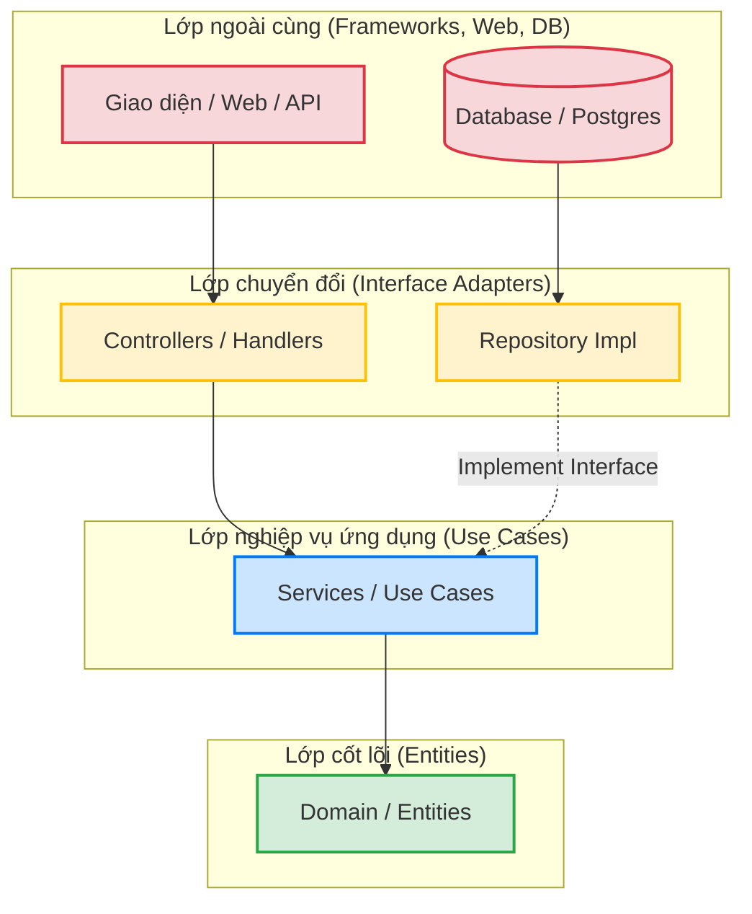

# Hướng Dẫn Về Clean Architecture (Kiến Trúc Sạch)

**Clean Architecture (Kiến trúc Sạch)** là một mô hình thiết kế phần mềm do Robert C. Martin (thường gọi là Uncle Bob) giới thiệu. Mục tiêu tối thượng của nó là **tách biệt các mối quan tâm (Separation of Concerns)**, giúp code của bạn:
1. Độc lập với Framework (không bị trói buộc vào Echo, Gin, hay React...).
2. Có thể test dễ dàng (Testable) mà không cần giao diện (UI) hay Database.
3. Độc lập với Database (bạn có thể đổi từ MySQL sang Postgres hay MongoDB dễ dàng).
4. Độc lập với Giao diện người dùng (UI).

## 1. Nguyên tắc Cốt lõi: Quy tắc Phụ thuộc (The Dependency Rule)

Tưởng tượng kiến trúc này như một củ hành tây có nhiều lớp. **Quy tắc quan trọng nhất là:** Mũi tên phụ thuộc chỉ được phép **hướng vào trong**. 

> [!IMPORTANT]
> Lớp bên trong KHÔNG ĐƯỢC PHÉP biết bất cứ thông tin gì về lớp bên ngoài nó (không import, không gọi hàm trực tiếp).



## 2. Các lớp (Layers) từ Trong ra Ngoài

*   🟢 **Lớp lõi - Entities (Domain):** Chứa các object, struct và logic cốt lõi nhất của hệ thống. Ví dụ: File `user.go` chứa struct User. Lớp này không phụ thuộc vào bất cứ ai.
*   🔵 **Lớp Use Cases (Service):** Nơi chứa logic nghiệp vụ của ứng dụng (ví dụ: Quy trình Đăng ký user cần kiểm tra email trùng, mã hóa mật khẩu, rồi lưu). Nó gọi tới lớp Domain.
*   🟡 **Lớp Interface Adapters (Handlers / Repository Interfaces):** Cầu nối chuyển đổi dữ liệu.
    *   **Handler:** Nhận JSON từ Web, chuyển thành Struct cho Service xử lý.
    *   **Repository Interface:** Định nghĩa các hàm lưu trữ (ví dụ: `SaveUser(user User)`) nhưng không quan tâm lưu bằng gì.
*   🔴 **Lớp Frameworks & Drivers (Infrastructure):** Nơi chứa code thực sự tương tác với bên ngoài (ví dụ code kết nối Postgres, code chạy HTTP server của Gin/Echo).

---

## 3. Thiết kế như nào là đúng (Đặc biệt trong Golang)?

Dựa vào cấu trúc thư mục của dự án, một cấu trúc chuẩn Clean Architecture trong Go thường trông như sau:

```text
internal/
├── core/                   # 1+2: Các lớp bên trong cùng (Không biết gì về DB, HTTP)
│   ├── domain/             # Lớp Entities: struct User, Category...
│   │   └── user.go         
│   └── service/            # Lớp Use Cases: Xử lý logic
│       └── user_service.go # Gọi interface của Repository để lưu data
│
├── api/                    # 3+4: Lớp bên ngoài (Giao tiếp với client)
│   └── rest/
│       └── handlers/       # Nhận HTTP Request, gọi Service, trả về JSON
│           └── user_handler.go 
│
└── repository/             # 3+4: Lớp tương tác Database
    └── postgres/           # Viết các câu lệnh SQL thực sự ở đây
        └── user_repo.go    # Implement interface của service
```

### Cách kết nối chúng lại (Dependency Injection)

> [!TIP]
> Nguyên tắc để lớp bên trong (Service) gọi được lớp bên ngoài (Database) mà không bị vi phạm nguyên tắc phụ thuộc là dùng **Interface**.

**Ví dụ thiết kế chuẩn:**

#### 1. Domain (`domain/user.go`)
```go
package domain

type User struct {
    ID       string
    Username string
    Email    string
}

// Service KHÔNG được import thư viện postgres
// Nó chỉ định nghĩa cái nó cần thông qua Interface
type UserRepository interface {
    Create(user *User) error
    FindByEmail(email string) (*User, error)
}
```

#### 2. Service (`service/user_service.go`)
```go
package service
import "microserice-ecomerce/internal/core/domain"

type UserService struct {
    // Inject interface vào thay vì dùng trực tiếp struct DB
    repo domain.UserRepository 
}

func NewUserService(r domain.UserRepository) *UserService {
    return &UserService{repo: r}
}

func (s *UserService) RegisterUser(email, name string) error {
    // Chứa logic kiểm tra, sau đó gọi interface để lưu
    user := &domain.User{Email: email, Username: name}
    return s.repo.Create(user)
}
```

#### 3. Infrastructure / Main (`cmd/main.go`) - Nơi ghép nối tất cả
Ở hàm `main`, bạn khởi tạo DB, tiêm (inject) nó vào Service, rồi tiêm Service vào Handler.
```go
// Khởi tạo Database thật
db := postgres.NewPostgresDB("postgres://...")
userRepo := postgres.NewUserRepository(db) // struct này implement UserRepository interface

// Tiêm Repo vào Service
userService := service.NewUserService(userRepo)

// Tiêm Service vào Handler
userHandler := handlers.NewUserHandler(userService)

// Chạy HTTP Server
router.POST("/users", userHandler.Register)
```

> [!NOTE]
> **Tóm lại Thiết kế Đúng là:** Lõi bên trong (Domain, Service) phải sạch sẽ, không import bất kỳ thư viện HTTP (gin, fiber) hay Database (gorm, sqlx) nào cả. Mọi tương tác ra ngoài đều phải đi qua **Interface**. Bạn chỉ ghép chúng lại với nhau ở hàm khởi tạo ngoài cùng (`main.go`).
