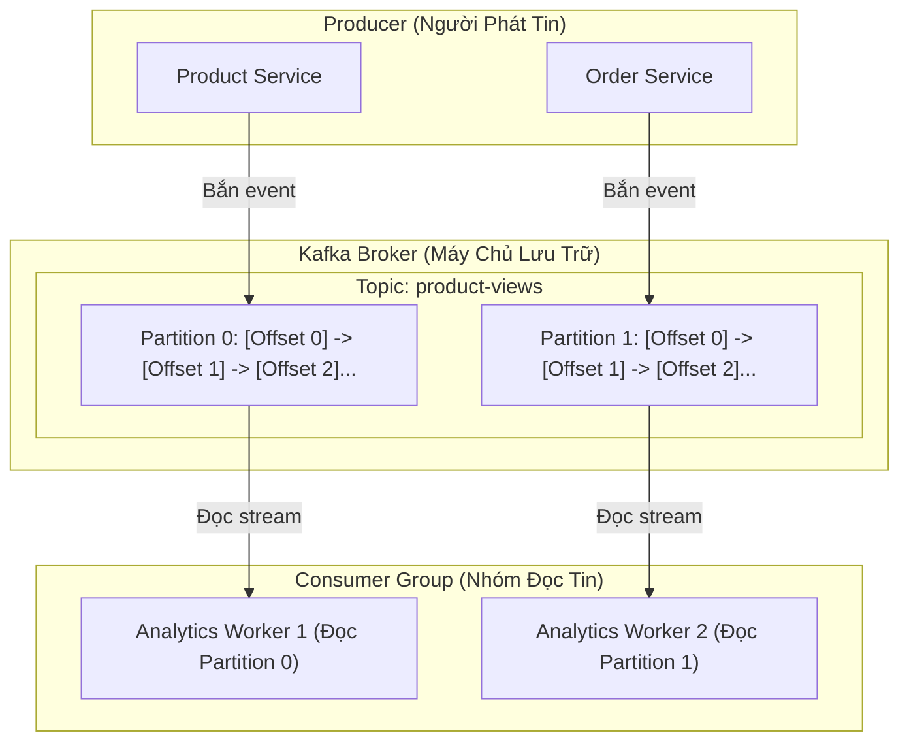

# 🎓 Cẩm Nang Toàn Diện Về Apache Kafka Cho Người Mới Bắt Đầu (A-Z Tutorial)

Tài liệu này được thiết kế theo phong cách **dễ hiểu, trực quan, có ví dụ thực tế về Thương Mại Điện Tử (E-Commerce)** để giúp bạn nắm vững bản chất của Apache Kafka chỉ sau 10 phút.

---

## 🧭 1. Apache Kafka Là Gì? (Ẩn Dụ Đời Thực)

Hãy tưởng tượng hệ thống E-Commerce của bạn là một **Siêu thị Điện Máy cực lớn**:
- Khi có khách hàng mua một chiếc **Máy Lạnh Daikin 13.500.000 ₫**, rất nhiều bộ phận cần biết thông tin này:
  1. **Kho hàng**: Để trừ số lượng tồn kho.
  2. **Kế toán**: Để xuất hóa đơn VAT.
  3. **Đội giao hàng**: Để xếp lịch vận chuyển tới nhà khách.
  4. **Bộ phận Marketing**: Để gửi Email/SMS cảm ơn kèm bảo hành.

### ❌ Nếu KHÔNG dùng Kafka (Cách cũ: Gọi HTTP API trực tiếp):
- Service Đơn Hàng phải lần lượt gọi HTTP sang Kho $\rightarrow$ gọi sang Kế toán $\rightarrow$ gọi sang Giao hàng $\rightarrow$ gọi sang Marketing.
- **Hậu quả**:
  - Khách hàng bấm "Đặt Hàng" và phải **ngồi chờ xoay vòng vòng 5 giây**.
  - Nếu hệ thống Marketing bị nghẽn mạng $\rightarrow$ Toàn bộ đơn hàng bị lỗi $\rightarrow$ Mất khách!

### ✅ Khi DÙNG Kafka (Event-Driven Architecture):
- Service Đơn Hàng chỉ cần ném đúng 1 mẩu tin: `{"event": "ORDER_CREATED", "product": "Máy lạnh Daikin"}` vào **Kafka** (mất **1 mili-giây**).
- Khách hàng nhận ngay thông báo: **"Đặt hàng thành công!"**.
- Kafka sẽ lưu mẩu tin đó an toàn trên đĩa cứng. Kho, Kế toán, Vận chuyển, Marketing sẽ tự động vào Kafka rút tin về xử lý theo tốc độ của riêng mình. Dù Marketing có sập nguồn, khi bật lại vẫn đọc tiếp được mà không làm mất đơn!

---

## 🏛️ 2. Bảy Khái Niệm Cốt Lõi (Core Concepts) Của Kafka



| Thuật ngữ | Ý nghĩa dễ hiểu | Ví dụ thực tế |
| :--- | :--- | :--- |
| **1. Broker** | Là 1 máy chủ Kafka (chạy container Docker `ecom-kafka`). | Nhà kho trung tâm tiếp nhận và lưu trữ tin nhắn. |
| **2. Topic** | Là "Kênh / Chủ đề" để phân loại tin nhắn. | Kênh `product-views` (Xem hàng), kênh `order-events` (Đơn hàng). |
| **3. Partition** | Mỗi Topic được chia nhỏ thành nhiều "Phân vùng" (Partition) để xử lý song song. | Thay vì 1 quầy tính tiền, siêu thị mở **4 làn quầy** để khách đi nhanh gấp 4 lần. |
| **4. Producer** | Ứng dụng gửi dữ liệu vào Kafka. | `Product Service` gửi tin mỗi khi khách xem máy lạnh. |
| **5. Consumer** | Ứng dụng đọc dữ liệu từ Kafka. | `Analytics Service` đọc tin để thống kê sản phẩm hot. |
| **6. Offset** | Số thứ tự tăng dần (0, 1, 2, 3...) của mỗi tin nhắn trong Partition. | Số thứ tự trên vé bốc thăm ở ngân hàng. |
| **7. Consumer Group** | Một nhóm các Consumer cùng chia nhau đọc 1 Topic để tăng tốc độ. | 3 nhân viên cùng chia nhau 3 làn quầy để xử lý hàng triệu đơn. |

---

## ⚡ 3. So Sánh Kafka vs RabbitMQ vs Redis Pub/Sub

| Tiêu chí | **Apache Kafka** | RabbitMQ | Redis Pub/Sub |
| :--- | :--- | :--- | :--- |
| **Bản chất** | **Distributed Commit Log** (Băng chuyền lưu trữ vĩnh viễn) | **Message Broker** (Hàng đợi gửi nhận truyền thống) | **In-memory Stream / Channel** |
| **Khả năng chịu tải** | 🌟 **Triệu messages / giây** | Hàng chục ngàn msg / giây | Rất nhanh nhưng tốn RAM |
| **Lưu trữ dữ liệu** | ✅ Lưu trên đĩa (Disk) 7 ngày hoặc vĩnh viễn | Xóa tin nhắn ngay khi Consumer nhận xong | Mất tin nếu không có ai nghe tại thời điểm đó |
| **Replay (Đọc lại tin cũ)**| ✅ **Có thể tua lại Offset để đọc lại dữ liệu 1 năm trước** | ❌ Không thể | ❌ Không thể |
| **Trường hợp sử dụng** | Log hệ thống, Phân tích hành vi, Event Streaming quy mô lớn | Xử lý Task hàng đợi phức tạp, định tuyến nâng cao | Thông báo tức thời (Chat, Noti real-time) |

---

## 🧪 4. Hướng Dẫn Thực Hành Demo Trực Tiếp

Trong dự án, chúng tôi đã tạo sẵn chương trình thực hành tại [cmd/demo-kafka/main.go](file:///home/nhat/Workspace/microserice-ecomerce/backend/cmd/demo-kafka/main.go).

### 🎯 Cách 1: Chạy Tự Động (Cả Producer & Consumer)
```bash
cd /home/nhat/Workspace/microserice-ecomerce/backend
go run cmd/demo-kafka/main.go
```

---

### 🎯 Cách 2: Trải Nghiệm 2 Terminal Riêng Biệt (Như Production Thật)

1. **Mở Terminal 1 - Bật Consumer đứng chờ:**
   ```bash
   cd /home/nhat/Workspace/microserice-ecomerce/backend
   go run cmd/demo-kafka/main.go consumer
   ```
   *(Consumer sẽ hiển thị: "Đang lắng nghe trên Topic 'demo-ecommerce-events'...")*

2. **Mở Terminal 2 - Bắn tin từ Producer:**
   ```bash
   cd /home/nhat/Workspace/microserice-ecomerce/backend
   go run cmd/demo-kafka/main.go producer
   ```

👉 **Quan sát:** Ngay khi Terminal 2 bắn từng sự kiện, Terminal 1 sẽ lập tức in ra chi tiết:
- **Partition:** Tin nhắn rơi vào phân vùng nào (0 hay 1).
- **Offset:** Số thứ tự của tin nhắn.
- **Message Key:** Khách hàng nào thực hiện.
- **Payload JSON:** Chi tiết đơn hàng.

---

## 🛠️ 5. Các Câu Lệnh Kafka CLI Cần Biết (Sử Dụng Docker)

Bạn có thể tương tác trực tiếp với Kafka container `ecom-kafka` bằng các lệnh CLI:

1. **Xem danh sách các Topic hiện có:**
   ```bash
   docker exec ecom-kafka /opt/kafka/bin/kafka-topics.sh --bootstrap-server localhost:9092 --list
   ```

2. **Xem chi tiết 1 Topic (Partitions, Replicas):**
   ```bash
   docker exec ecom-kafka /opt/kafka/bin/kafka-topics.sh --bootstrap-server localhost:9092 --describe --topic product-views
   ```

3. **Đọc toàn bộ tin nhắn trong 1 Topic từ đầu đến cuối (Replay Data):**
   ```bash
   docker exec ecom-kafka /opt/kafka/bin/kafka-console-consumer.sh --bootstrap-server localhost:9092 --topic product-views --from-beginning
   ```

4. **Kiểm tra tiến độ đọc của các Consumer Group (Xem có bị nghẽn Lag không):**
   ```bash
   docker exec ecom-kafka /opt/kafka/bin/kafka-consumer-groups.sh --bootstrap-server localhost:9092 --list
   ```
