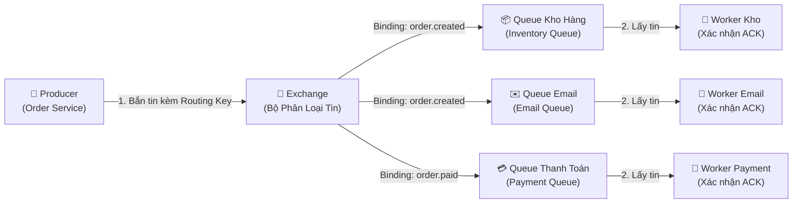
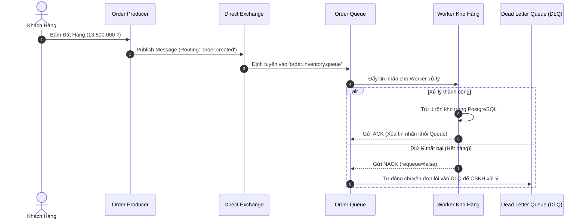

# 🎓 Cẩm Nang Toàn Diện Về RabbitMQ Cho Người Mới Bắt Đầu (A-Z Tutorial)

Tài liệu này được thiết kế theo phong cách **dễ hiểu, trực quan, có ví dụ thực tế về Thương Mại Điện Tử (E-Commerce)** để giúp bạn nắm vững bản chất của **RabbitMQ** và hiểu rõ sự khác biệt giữa **RabbitMQ và Apache Kafka** chỉ sau 10 phút.

---

## 🧭 1. RabbitMQ Là Gì? (Ẩn Dụ Bưu Điện Thông Minh)

Hãy tưởng tượng hệ thống E-Commerce của bạn là một **Trụ sở Bưu Điện trung tâm**:
- **Khách hàng** (Producer) mang bưu phẩm/thư từ đến gửi.
- **Nhân viên phân loại bưu phẩm** (**Exchange**) nhìn vào địa chỉ trên phong bì (**Routing Key**).
- Dựa trên quy tắc chuyển phát (**Binding**), nhân viên sẽ ném bức thư vào đúng **Hòm thư / Hộp thư của từng khu vực** (**Queue**).
- **Người đưa thư** (**Consumer**) chỉ việc đến hòm thư của mình, lấy thư đi giao và ký giấy xác nhận (**ACK**).



---

## 🏛️ 2. Bảy Khái Niệm Cốt Lõi Của RabbitMQ

| Thuật ngữ | Ý nghĩa dễ hiểu | Ví dụ thực tế trong E-Commerce |
| :--- | :--- | :--- |
| **1. Producer** | Ứng dụng tạo và gửi tin nhắn. | `Order Service` tạo đơn hàng khi khách bấm mua. |
| **2. Exchange** | Bộ điều phối & phân loại tin nhắn (Producer **không bao giờ** gửi thẳng vào Queue mà gửi qua Exchange). | Nhân viên bưu điện đọc địa chỉ để phân loại thư. |
| **3. Routing Key** | "Nhãn địa chỉ" gắn trên tin nhắn để Exchange biết đường gửi. | `order.created` (Tạo đơn), `order.paid` (Đã thanh toán). |
| **4. Queue (Hàng đợi)** | Hộp thư lưu trữ tin nhắn theo thứ tự FIFO (Vào trước - Ra trước) cho đến khi Consumer lấy đi. | Hàng đợi chứa các đơn chờ trừ kho: `order.inventory.queue`. |
| **5. Binding** | "Cầu nối / Luật liên kết" giữa Exchange và Queue với một Routing Key cụ thể. | Luật: *"Hễ có thư ghi 'order.created' thì ném vào Queue Kho Hàng"*. |
| **6. Consumer** | Ứng dụng lấy tin nhắn từ Queue về để xử lý công việc. | `Inventory Worker` lấy đơn về để giảm tồn kho trong Database. |
| **7. ACK / NACK** | Lời hồi đáp của Consumer báo cho RabbitMQ biết tin nhắn đã xử lý xong hay bị lỗi. | **ACK**: Xong rồi, hãy xóa tin đi.<br>**NACK**: Bị lỗi, hãy chuyển vào hàng đợi lỗi (DLQ). |

---

## 🔀 3. Bốn Loại Exchange Thần Thánh Trong RabbitMQ

RabbitMQ vượt trội ở khả năng **định tuyến tin nhắn linh hoạt** nhờ 4 loại Exchange:

### 1. Direct Exchange (Định tuyến chính xác từng từ khóa)
* **Nguyên lý:** Tin nhắn có Routing Key là gì thì ném chính xác vào Queue có Binding Key y hệt như vậy.
* **Ứng dụng:** Xử lý đơn hàng, thông báo riêng cho từng phòng ban.

### 2. Fanout Exchange (Phát thanh quảng bá toàn sàn)
* **Nguyên lý:** **Bỏ qua Routing Key**. Hễ có tin nhắn đến là Exchange tự động nhân bản và gửi cho **TẤT CẢ các Queue** đang kết nối với nó.
* **Ứng dụng:** Thông báo Siêu Sale 9.9, thông báo bảo trì hệ thống toàn sàn.

### 3. Topic Exchange (Định tuyến thông minh với Ký tự đại diện Wildcard)
* **Nguyên lý:** Cho phép khớp mẫu địa chỉ linh hoạt:
  * Dấu `*` (Star): Đại diện cho **đúng 1 từ** (vd: `order.*.europe`).
  * Dấu `#` (Hash): Đại diện cho **0 hoặc nhiều từ** (vd: `order.#`).
* **Ứng dụng:** Hệ thống theo dõi đơn hàng quốc tế: `order.asia.vietnam.electronics`.

### 4. Headers Exchange (Định tuyến bằng Header thuộc tính)
* **Nguyên lý:** Dựa vào các thuộc tính metadata trong Header của tin nhắn (vd: `format=pdf`, `priority=high`) thay vì dựa vào chuỗi Routing Key.

---

## 🛡️ 4. Cơ Chế Đảm Bảo An Toàn Dữ Liệu & Chống Mất Tin

Trong hệ thống E-commerce, mất một đơn hàng là mất tiền của doanh nghiệp. RabbitMQ bảo vệ dữ liệu như thế nào?

### A. Message Durability (Lưu tin xuống đĩa cứng)
* Khi khai báo Exchange & Queue với thuộc tính `durable = true` và gửi tin nhắn với `DeliveryMode = Persistent`:
  👉 Dù server RabbitMQ có bị mất điện đột ngột, khi bật lại **toàn bộ tin nhắn chưa xử lý vẫn còn nguyên vẹn**.

### B. Manual Acknowledgement (Xác nhận thủ công)
* Mặc định, nếu không bật xác nhận thủ công, RabbitMQ sẽ xóa tin ngay khi vừa gửi cho Consumer. Nếu Consumer đang xử lý nửa chừng mà bị sập nguồn $\rightarrow$ **Mất đơn!**
* Khi dùng **Manual ACK**:
  * Consumer xử lý xong hoàn toàn $\rightarrow$ gọi `d.Ack(false)` $\rightarrow$ RabbitMQ mới xóa tin.
  * Nếu Consumer gặp lỗi $\rightarrow$ gọi `d.Nack(false, false)` $\rightarrow$ Tin nhắn được chuyển an toàn sang **Dead Letter Queue (DLQ)**.

### C. Dead Letter Queue (DLQ - Hàng đợi thư chết)
* Khi một đơn hàng bị lỗi (ví dụ thẻ ngân hàng hết tiền, kho hết hàng, dữ liệu JSON bị hỏng):
* Thay vì để tin nhắn gây tắc nghẽn hàng đợi chính, RabbitMQ tự động đẩy đơn hàng lỗi sang **DLQ**.
* Đội ngũ Kế toán / Chăm sóc khách hàng sẽ vào DLQ để kiểm tra và xử lý thủ công mà không làm ảnh hưởng đến các đơn hàng khác.



---

## ⚡ 5. So Sánh Toàn Diện: RabbitMQ vs Apache Kafka vs Redis

| Tiêu chí | 🐰 **RabbitMQ** | 📦 **Apache Kafka** | ⚡ **Redis Pub/Sub & Asynq** |
| :--- | :--- | :--- | :--- |
| **Bản chất kiến trúc** | **Message Broker thông minh** (Hàng đợi lưu tạm) | **Distributed Commit Log** (Băng chuyền lưu vĩnh viễn) | **In-Memory Cache / Queue** |
| **Mô hình vận hành** | **Push Model:** Broker chủ động đẩy tin nhắn cho Consumer | **Pull Model:** Consumer chủ động kéo tin theo tốc độ của mình | Push / Polling |
| **Xóa dữ liệu** | ✅ Xóa ngay sau khi Consumer gửi ACK | ⏳ Giữ lại theo thời gian (vd: 7 ngày, 30 ngày) | Xóa ngay khi nhận |
| **Đọc lại tin cũ (Replay)**| ❌ Không thể (đã ACK là mất) | ✅ **Có thể tua lại Offset để đọc lại dữ liệu 1 năm trước** | ❌ Không thể |
| **Khả năng định tuyến** | 🌟 **Vô địch:** Direct, Fanout, Topic, Headers linh hoạt | Đơn giản: Theo Topic & Partition Key | Theo Channel Pattern |
| **Tốc độ xử lý** | Hàng chục ngàn tin / giây (Độ trễ siêu thấp cỡ micro-giây) | 🌟 **Hàng triệu tin / giây** | Siêu nhanh (Bộ nhớ RAM) |
| **Trường hợp tối ưu nhất** | ✅ Giao việc phức tạp (Background Jobs), Gửi Email, Xử lý Thanh toán, Cần ACK/NACK chặt chẽ | ✅ Phân tích Log Big Data, Thống kê hành vi người dùng, Event Sourcing, Streaming | ✅ Thông báo Realtime, Chat nhanh, Cache |

---

## 🧪 6. Hướng Dẫn Thực Hành Demo Trực Tiếp

Chương trình thực hành đã được tích hợp sẵn tại [cmd/demo-rabbitmq/main.go](file:///home/nhat/Workspace/microserice-ecomerce/backend/cmd/demo-rabbitmq/main.go).

### Bước 1: Khởi động container RabbitMQ
```bash
docker compose up -d rabbitmq
```

### Bước 2: Truy cập Giao Diện Quản Trị Trực Quan (Web UI)
* Mở trình duyệt: **`http://localhost:15672`**
* **Tài khoản:** `guest`
* **Mật khẩu:** `guest`
* Tại đây bạn có thể thấy đồ thị lưu lượng tin nhắn, danh sách Exchanges, Queues theo thời gian thực!

---

### 🎯 Cách 1: Chạy Tự Động (Full Demo)
```bash
cd /home/nhat/Workspace/microserice-ecomerce/backend
go run cmd/demo-rabbitmq/main.go
```

---

### 🎯 Cách 2: Trải Nghiệm 2 Terminal Riêng Biệt (Production Real-time)

1. **Mở Terminal 1 - Bật Consumer đứng chờ:**
   ```bash
   cd /home/nhat/Workspace/microserice-ecomerce/backend
   go run cmd/demo-rabbitmq/main.go consumer
   ```

2. **Mở Terminal 2 - Bắn các đơn hàng mẫu từ Producer:**
   ```bash
   cd /home/nhat/Workspace/microserice-ecomerce/backend
   go run cmd/demo-rabbitmq/main.go producer
   ```

3. **Mở Terminal 3 - Thử nghiệm phát thanh quảng bá (Fanout):**
   ```bash
   cd /home/nhat/Workspace/microserice-ecomerce/backend
   go run cmd/demo-rabbitmq/main.go fanout
   ```

👉 **Quan sát:**
* Đơn hàng hợp lệ (`ORD-1001`, `ORD-1002`) sẽ được cả Kho hàng và Email xử lý và gửi **ACK**.
* Đơn hàng cố tình gây lỗi (`ORD-1003-ERROR`) sẽ bị Kho hàng **NACK** và lập tức bị RabbitMQ đẩy sang **Dead Letter Queue (DLQ)**!

---

## 🛠️ 7. Các Câu Lệnh RabbitMQ CLI Cần Biết

Bạn có thể tương tác trực tiếp với container `ecom-rabbitmq`:

1. **Kiểm tra trạng thái máy chủ RabbitMQ:**
   ```bash
   docker exec ecom-rabbitmq rabbitmqctl status
   ```

2. **Xem danh sách tất cả Hàng đợi (Queues) và số lượng tin nhắn đang chờ:**
   ```bash
   docker exec ecom-rabbitmq rabbitmqctl list_queues name messages consumers
   ```

3. **Xem danh sách tất cả Exchanges:**
   ```bash
   docker exec ecom-rabbitmq rabbitmqctl list_exchanges name type
   ```

4. **Xem các liên kết Binding giữa Exchange và Queue:**
   ```bash
   docker exec ecom-rabbitmq rabbitmqctl list_bindings
   ```
